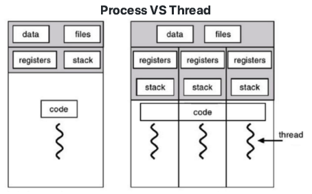

## 운영체제의 역할

1. 시스템 자원(System Resource) 관리자

   1. 시스템 자원(System Resource)은 컴퓨터 하드웨어이다. 

      - 하드웨어는 스스로 할수 있는 것이 없기때문에 운영체제가 필요하다.

      1. CPU(중앙처리장치), Memory(DRAM, RAM)
      2. I/O Devices(입출력 장치) - Monitor, Mouse, Keyboard, Network
      3. 저장 매체 : SSD, HDD

2. 사용자와 컴퓨터간의 커뮤니케이션을 지원한다.

3. 컴퓨터 하드웨어와 응용 프로그램을 제어한다.

## 응용프로그램이란?

- 프로그램 = 소프트웨어
- 소프트웨어 = 운영체제, 응용 프로그램(엑셀, 파워포인트 등)
- 응용 프로그램 = Application(일반 PC 프로그램) = App (스마트폰 프로그램)

#### 운영체제와 응용 프로그램간의 관계

- 운영체제는 응용 프로그램을 관리
  - 응용 프로그램을 실행
  - 응용 프로그램간의 권한을 관리 -  관리자 권한으로 실행
  - 응용 프로그램을 사용하는 사용자도 관리 - 로그인

> 운영체제 목표 : 사용자가 사용하는 응용 프로그램이 효율적으로, 적절하게 동작하도록 지원   

> 운영체제는 응용 프로그램이 요청하는 시스템 리소스를 효율적으로 분배하고, 지원하는 소프트웨어

## 운영체제의 역사

### 1960년대 초기

- 배치 처리 시스템 출력
  - 여러 응용 프로그램을 등록시켜놓으면, 순처적으로 실행하는 시스템
  - 배치 처리 시스템을 기반으로 운영체제가 출연

### 1960년대 후반

- 새로운 개념이 제안됨
  - 시분할 시스템(Time Sharing System)
    - 다중 사용자를 지원하고, 컴퓨터 응답시간을 최소화하는 시스템
  - 멀티 태스킹(Multi Tasking)
    - 단일 CPU에서, 여러 응용 프로그램의 병렬 실행을 가능케 하는 시스템
  - 보통은 시분할 시스템 = 멀티 태스킹

> 운영체제로 구현되지는 않았습니다.

> 멀티 프로그래밍 : 최대한 CPU를 많이 활용하도록 하는 시스템(시간대비 CPU 활용도를 높이자)

#### 배치 처리시스템이 단점

1. 컴퓨터 응답시간이 오래 걸릴수 있다.(앞단에 실행시간이 많이 필요로 하는 응용프로그램이 실행될 경우)
2. 실행 시간도 오래 걸릴 수 있다.(CPU가 필요없음에도 응용 프로그램이 CPU를 점유 할 수 있기 때문이다)

#### 시분할 시스템/멀티 태스킹

- 핵심기술 : 시간을 잘게 쪼개서, 여러 응용 프로그램을 실행
  - 컴퓨터 응답시간을 줄일수 있음(시분할시스템, 다중사용자를 지원)
  - 전체 응용 프로그램의 실행 시간도 줄일 수 있음(멀티 프로그래밍)
  - 결과적으로, 사용자가 느낄 때에는 여러 응용 프로그램이 동시에 실행되는 것처럼 보인다(멀티 태스킹)

### 1970년대 

> 제대로된 운영체제가 나왔다

UNIX(유닉스) OS

- 미국 AT&T 사의 벨 연구소에서 개발
  - 켄 톰슨, 데니스 리치 : C언어를 개발
- 현대 운영체제의 기본 기술을 모두 포함한 최초의 운영체제
  - 멀티 태스킹, 시분할 시스템, 멀티 프로그래밍
    - 다중 사용자 지원

### 1980년대

> 개인용 컴퓨터 시대

>  CLI에서 GUI로 변화하는 시기

CLI(Command Line Interface) : 터미널 환경

- 키보드, 검은 화면

GUI(Grapical User Interface) : GUI환경

- 마우스

### 1990년대

1. 응용 프로그램 시대(GUI환경), 개인용 컴퓨터(사용자 증대)
   1. 엑셀, 워드 프로세서 등등
   2. Windows OS대중화

2. 네트워크 기술 발전 
   1. WWW 인터넷 대중화
3. 오픈 소스 운동 활성화 시작
   1. UNIX계열 OS + 응용 프로그램 자체 개발, 소스 오픈
   2. LINUX 운영체제, 소스 오픈, 무료

### 2000년대 이후

1. 오픈 소스 활성화
   1. LINUX 운영체제
   2. Apache( 웹서버)
   3. MySQL(데이터 베이스)
   4. 안드로이드, 딥러닝, 데이터 사이언ㅅ, IoT관련
2. 가상 머신, 대용량 병렬 처리등 활성화

## 운영제제 구조

#### 응용 프로그램, 운영체제, 컴퓨터 하드웨어 관계

- 도서관으로 비유
  - 운영체제는 도서관
  - 응용 프로그램은 시민
  - 컴퓨터 하드웨어는 책
  - 운영체제의 역할
    - 시민은 도서관에 원하는 책(자원)을 요청함
    - 도서고나은 적절한 책(자원)을 찾아서, 시민에게 빌려줌
    - 시민이 기한이 다 되면, 도서관이 해당 책(자원)을 회수함

#### 운영체제는 사용자 인터페이스를 제공

- 쉘(Shell)
  - 사용자가 운영체제 기능과 서비스를 조작 할 수 있도록 인터페이스를 제공하는 프로그램
  - CLI, GUI환경 두종류로 분류
- API(Application Programmin Interface)
  - 함수로 제공 
  - open()
- 보통은 라이브러리(library) 형태로 제공
  - C library
- 시스템 콜
  - 시스템 콜 또는 시스템 호출 인터페이스
  - 운영체제가 운영체제 각 기능을 사용할 수 있도록 시스템 콜이라는 명령 또는 함수를 제공
  - API 내부에는 시스템 콜을 호출하는 형태로 만들어지는 경우가 대부분임.

#### CPU Protetion Rings

- CPU도 권한 모드라는 것을 가지고 있습니다.

  - 사용자모드(user mode) : 응용프로그램이 사용한다.

  - 커널모드(kernel mode) : OS가 사용하며 특권 명령어 실행과 원하는 작업 수행을 위한 자원 접근을 가능하게 하는 모드

  - 응용프로그램이 전체 컴퓨터 시스템을 헤치지 못하게 하기 위해서 사용자 모드에서만 동작하고 운영체제 기능이 필요한 API를 호출하면, 시스템 콜이 호출되서, 커널 모드로 변경되어 OS 내부에서 해당 명령이 실행되고 다시 응용 프로그램으로 돌아간다.

     

## 프로세스 스케쥴링

#### 멀티 태스킹과 멀티 프로세싱

멀티 태스킹 : 단일 CPU 사용

멀티 프로세싱 : 여러 CPU에 하나의 프로그램을 병렬로 실행해서 실행속도를 극대화시키는 시스템

멀티 프로그래밍 : 최대한 CPU를 일정 시간당 많이 활용하는 시스템

## 스케쥴링 알고리즘

#### 프로세스(process)란?

- 실행중인 프로그램은 프로세스라고 한다.
  - 프로세스 : 메모리에 올려져서, 실행중인 프로그램
  - 코드 이미지(바이너리) : 실행파일, 예:ELF format

> 프로세스라는 용어는 작업, task, job이라는 용어와 혼용

- 단 응용프로그램은 != 프로세스
  - 응용프로그램은 여러개의 프로세스로도 이루어질수도 있기때문이다.

> 누가 프로세스 실행을 관리할까? 스케쥴러가 관리하고 스케쥴링 알고리즘에 따라 프로세스를 실행한다.

#### FIFO 스케쥴러

> 프로세스가 저장매체를 읽는 다든지, 프린팅을 한다든지 하는 작업 없이, 쭉 CPU를 처음부터 끝까지 사용한다.

- 가장 간단한 시케쥴러(배치 처리시스템)
- FCFS(First Come First Servec) 스케쥴러라고도 함
- QUEUE 동작방식하고 동일함.

#### 최단 작업 우선(SJF) 스케쥴러

- SJF(Shortest Job First) 스케쥴러
  - 가장 프로세스 실행시간이 짧은 프로세스부터 먼저 실행을 시키는 알고리즘

#### OS의 구분

- RealTime OS(RTOS) : 응용 프로그램 실시간 성능 보장을 목표로 하는 OS
  - 정확하게 프로그램 시작, 완료 시간을 보장
  - Hardware RTOS, Software RTOS
- General Purpost OS(GPOS)
  - 프로세스 실행시간에 민감하지 않고 일반적인 목적으로 사용되는 OS
  - Windows, Linux 등

#### 우선순위 기반 스케쥴러

- Priority-Based 스케쥴러
  - 정적 우선순위
    - 프로세스마다 우선순위를 미리 지정
  - 동적 우선순위
    - 스케쥴러가 상황에 따라 우선순위를 동적으로 변경

#### Round Robin 스케쥴러

- 시분할 시스템 기반 스케쥴러

  

#### 프로세스 상태

- running state : 현재 CPU에서 실행 상태
- ready state : CPU에서 실행 가능상태(실행 대기 상태)
- block state : 특정 이벤트 발생 대기 상태(예:프린팅이 다 되었다.)

#### 프로세스 상태간 관계

#### 선전형과 비선점형 스케쥴러

- 선점형 스케쥴러(Preemptive Scheduling)
  - 하나의 프로세스가 다른 프로세스 대신에 프로세서(CPU)를 차지할 수 있음
  - 프로세스 runnging중에 스케쥴러가 이를 중단시키고, 다른 프로세스로 교체가능
- 비선점형 스케쥴러(Non-Preemptive Scheduling)
  - 하나의 프로세스가 끝나지 않으면 다른 프로세스는 CPU를 사용할 수 없음
  - 프로세스가 자발적으로 blocking 상태로 들어가거나, 실행이 끝났을 때만, 다른 프로세스로 교체가능

## 인터럽트

#### 인터럽트란?

- CPU가 프로그램을 실행하고 있을 때, 입출력 하드웨어 등의 장치나 예외상황이 발생하여 처리가 필요할 경우에 CPU에 알려서 처리하는 기술
- 인터럽트는 일종의 이벤트로 불림

#### 인트럽트가 필요한 이유

- 선점형 스케쥴러에서 현재 running중인 스케쥴러를 중단시키고, 다른 프로세스로 교체하기 위해서 

- 저장매체에서 데이터 처리완료시, 프로세스를 깨워햐함(block state -> ready state)

- CPU가 프로그램을 실행하고 있을때, 입출력 하드웨어 등의 장치나 예외상황이 발생한경우, CPU가 해당 처리를 할 수 있도록 CPU에게 알려줘야함

  

#### 인터럽트 종류

- 내부(소프트웨어)인터럽트

  - 주로 프로그램 내부에서 잘못된 명령 또는 잘못된 데이터 사용시 발생
    - 0으로 나웠을때
    - 사용자 모드에서허용되지 않은 명령 또는 공간 접근시
    - 계산 결과가 Overflow/Underflow 날때

- 외부(하드웨어)인터럽트

  - 주로 하드웨어에서 발생하는 이벤트(프로그램 외부)
    - 전원이상, 기계문제, IO관련 이벤트, Timer이벤트

- 시스템 콜 인터럽트

  - 시스템콜 실행을 위해서는 강제로 코드에 인터럽트 명령을 넣어, CPU에게 실행시켜야한다.

    - 시스템콜 인터럽트 명령을 호출하면서 0x80값을 넘겨줌

      - CPU는 사용자 모드를 커널모드로 바꿔줌

      - IDT(Interrupt Descriptor Table)에서 0x80에 해당하는 주소(함수)를 찾아서 실행함

      - System_call() 함수에서 eax로 부터 시스템 콜번호를 찾아서, 해당번호에 맞는 시스템콜 함수로 이동

      - 해당 시스템콜 함수 실행후, 다시 커널모드에서 사용자 모드로 변경하고, 다시 해당 프로세스 다음코드 진행함.

        

      

#### IDT(Interrupt Descriptor Table)

- 인터럽트는 미리 정의되어 각각 번호와 실행코드를 가리키는 주소가 기록되어 있음
  - 어디에 ?  IDT에 기록
  - 언제 ? 컴퓨터 부팅시 운영체제가 기록
  - 어떤 코드 ? 운영체제 내부 코드
- 리눅스의 eax 예
  - 0 ~31 : 예외상황 인터럽트(일부는 정의 안된채로 남겨져 있음)
  - 32 ~47 : 하드웨어 인터럽트(주변장치 종류/갯수에 따라 변경가능)
  - 128 : 시스템콜

## 프로세스와 컨텍스트 스위칭

#### 프로세스 구조

- TEXT(CODE) : 코드
- DATA(BSS,DATA) : 변수/초기화된 데이터
- Stack : 임시 데이터(함수 호출, 로컬변수등)
- HEAP : 코드에서 동적으로 만들어지는 데이터

#### PCB(Process Control Block)

> PC(Program Count), SP(Stack Pointer)는 PCB에 저장된다.
>
> 프로스세가 실행중인 상태를 켭쳐/구조화해서 PCB에 저장한다.

- 상태 정보

  - Process ID
  - Register(PC, SP등)
  - Scheduling Info(Process State)
  - Memory Info

  

#### 컨텍스트 스위칭(문맥 교환)

- CPU에 실행할 프로세스를 교체하는 기술
  - 실행 중지할 프로세스 정보를 해당 프로세스의 PCB에 업데이트해서, 메인 메모리에 저장
  - 다음 실행할 프로세스 정보를 메인 메모리에 있는 해당 PCB정보(PC, SP)를 CPU의 레지스터에 넣고 실행

## 프로세스간 커뮤니케이션

- 프로세스는 다른 프로세스의 공간을 접근할 수 없다.

> 프로세스간에 커뮤니케이션을 해야한다면 어떻게 해야할까?

- 프로게스간 통신 방법을 제공함 -> IPC(InterProcess Communication)

> 프로세스간 통신이 필요할까?

- 성능을 높이기 위해 여러 프로세스를 만들어서 동시 실행
- 이때 프로세스간 상태 확인 및 데이터 송수신이 필요

#### 다양한 IPC 기법

1. file 사용 - 실시간으로 직접 원하는 데이터 전달이 어려움. 파일을 읽어야 하는데 파일을 계속 읽을수 없으니 속도도 느리고 
2. Message Queue
   1. 큐니까, 기본은 FIFO정책으로 데이터 전송
   2. 부모/자식이 아니라, 어느 프로세스간에라도 데이터 송수신이 가능
   3. 양방향 통싱이 가능
3. Shared Memory
   1. 노골적으로 kernel space에 메모리 공간을 만들고, 해당 공간을 변수처럼 쓰는 방식
   2. 공유메모리 key를 가지고, 여러 프로세스가 접근가능
4. Pipe
   1. 기본파이프는 단방향 통신
   2. fork()로 자식프로세스 만들었을 때, 부모와 자신간의 통신
5. Signal
   1. 유닉스에서 30년이상 사용된 전통적인 기법
   2. 커널 또는 프로세스에서 다른 프로세스에 어떤 이벤트가 발생되었는지를 알려주는 기법
   3. 프로세스 관련 코드에 관련 시그널 핸들러를 등록해서, 해당 시그널 처리 실행
      1. 시그널 무시
      2. 시그널 블록(블록을 푸는 순간, 프로세스에 해당 시그널 전달)
      3. 등록된 시그널 핸들러로 특정 동작 수행
      4. 등록된 시그널 핸들러가 없다면, 커널에서 기본 동작 수행
   4. 주요 시그널
      1. SIGKILL : 프로세스를 죽여라
      2. SIGALARAM : 알람을 발생한다.
      3. SIGSTP : 프로세스를 멈춰라(Ctrl + z)
      4. SIGCONT : 멈춰진 프로세스를 실행해라
      5. SIGINT : 프로세스에 인터럽트를 보내서 프로세스를 죽여라(Ctrl + c)
      6. SIGSEGV  : 프로세스가 다른 메모리영역에 침범했다.
6. Semahpore
7. Socket
   1. 소켓은 네트워크 통신을 위한 기술
   2. 기본적으로는 클라이언트와 서버등 두개의 컴퓨터간의 네트워크 기반 통신을 위한 기술
   3. 소켓을 하나의 컴퓨터 안에서, 두개의 프로세스간에 통신 기법으로 사용가능

> 2번부터는 모두 커널 공간을 사용함. 왜냐하면 커널공간은 공유가 되기 때문이다. 

## Thread(스레드)

#### 스레드

- Light Weight Process 라고도 함
- 하나의 프로세스에 여러개의 스레드 생성가능
- 스레드들은 동시에 실행가능
- 프로세스 안에 있으므로, 프로세스의 데이터를 모두 접근 가능

- 장점
  - 사용자에 대한 응답성 향사
  - 자원공유 효율
    - IPC기법과 같이 프로세스간 자원 공유를 위해 번거로운 작업이 필요없음
    - 프로세스 안에 있으므로, 프로세스의 데이터를 모두 접근 가능
    - 작업이 분리되어 코드가 간결 - 작성하기 나름
- 단점
  - 스레드 중 한 스레드만 문제가 있어도, 전체 프로세스가 영햐을 받음
  - 스레드를 많이 생성하면, Context Switching이 많이 일어나, 성능저하
- 동기화(Synchronization) 이슈
  - 동기화 : 작업들 사이에 실행 시기를 맞추느 ㄴ것
  - 여러 스레드가 동일한 자원(데이터) 접근시 동기화 이슈 발생
    - 동일 자원을 여러 스레드가 동시 수정시, 각 스레드 결과에 영향을 줌
  - 해결방안
    - Mutual exclusion(상호 배제)
      - 임계자원(critical resource)
      - 임계영역(critical section)
    - 스레드는 프로세스 모든 데이터를 접근할 수 있으므로,
      - 여러 스레드가 변경하는 공유변수에 대해 Exclusize Access 필요
      - 어느 한 스레드가 공유 변수를 갱신하는 동안 다른 스레드가 동시 접근하지 못하도록 막아라

#### Mutex 와 Semaphore(세마포어)

- Critical Section(임계 구역)에 대한 접근을 막기 위해 LOCKING 메커니즘이 필요
  - Mutex(binary semaphore)
    - 임계 구역에 하나의 스레드만 들어 갈 수 있음
  - Semaphore
    - 임계구역에 여러 스레드가 들어갈 수 있음
    - counter를 두어서 동시에 리소스에 접근 할 수 있는 허용 가능한 스레드 수를 제어
    - 주요 세마포어 함수(POSIX 세마포어)
      - sem_open() : 세마포어를 생성
      - sem_warit() : 임계영역 접근 전, 세마포어를 잠그고, 세마포어가 잠겨있다면, 풀릴 때까지 대기
      - sem_post() : 공유자원에 대한 접근이 끝났을때 세마포어 잠금을 해제한다.

#### 교착상태(Deadlock) 와 기아상태(Starvation)

##### 교착상태란?

- 무한 대기 상태 : 두개 이상의 작업이 서로 상배당의 작업이 끝나기만을 기다리고 있기 때문에, 다음 단계로 진행하지 못하는 상태

##### 교착상태 발생조건

1. 상호배제(Mutual exclustion) : 프로세스들이 필요로 하는 자원에 대해 배타적인 통제권을 요구한다.
2. 점유대기(Hold and wait) : 프로세스가 할당된 자원을 가진 상태에서 다른 자원을 기다린다.
3. 비선점(No preemption) : 프로세스가 어떤 자원의 사용을 끝낼 때까지 그 자원을 뺏을 수 없다.
4. 순환대기(Circular wait) : 각 프로세스는 순환적으로 다음 프로세스가 요구하는 자원을 가지고 있다.

##### 교착상태 해결방법

1. 교착생태 예방
   1. 상보배제 조건의 제거 : 임의영역 제거
   2. 점유와 대기 조건의 제거 : 한번에 모든 필요 자원 점유 및 해제
   3. 비선점 조건 제거 : 선점 가능 기법을 만들어줌
   4. 순환 대기 조건 제거 : 자원 유형에 따라 순서를 매김
2. 교착상태 회피
   1. 교착상태 조건 1,2,3은 놔두고 4번만 제거
      1. 1,2,3제거시, 프로세스 실행 비효율성이 증대 
   2. 교착 상태 조건중, 자원할당 순서를 정의하지 않음(순화 대기 조건 제거)
3. 교착상태 발견
   1. 교착상태가 발생했느지 점검하여 교착 상태에 있는 프로세스와 자원을 발견하는 것
4. 교착상태 회복
   1. 교착 상태를 일으킨 프로세스를 종료하거나 교착상태의 프로세스에 할당된 자원을 선점하여 프로세스나 자원을 회복하는것

##### 기아상태(starvation)

- 특정 프로세스의 우선순위가 낮아서 원하는 자원을 계속 할당 받지 못하는 상태
- 교착상태와 기아상태
  - 교착상태는 여러 프로세스가 동일 자원 점유를 요청할 때 발생
  - 기아생태는 여러 프로세스가 부족한 자원을 점유하기 위해 경쟁할때, 특정 프로세스는 영원히 자원 할달이 안되는 경우를 주로 의미함
- 해결방안 
  - 우선순위병경
    - 프로세스 우선순위를 수시로 변경해서, 각 프로세스가 높은 우선순위를 가질 기회주기
    - 오래 기다린 프로세스의 우선순위를 높여주기
    - 우선순위가 아닌, 요청 순서대로 처릴하는 FIFO기반 요청큐 사용

## 가상메모리

> 실제 각 프로세스마다 충분한 메모리를 할당하기에는 메모리 크기가 한계가 있음

> 폰노이만 구조 기반이므로, 코드는 메모리에 반드시 있어야 함

- 가상 메모리 : 메모리가 실제 메모리보다 많아 보이게 하는 기술
  - 실제 사용하는 메모리는 작다는 점에 착안해서 고안된 기술
  - 프로세스간 공간 분리로, 프로세스 이슈가 전체 시스템에 영향을 주지 않을 수 있음
- 가상 메모리 기본 아이디어
  - 프로세스는 가상주소를 사용하고, 실제 해당 주소에서 데이터를 읽고/쓸때만 물리 주소로 바꿔주면 된다.
  - virtual address(가상 주소) : 프로세스가 참조하는 주소
  - Physical address(물리 주소) : 실제 메모리 주소
- MMU(Memory Management Unit)
  - CPU에 코드 실행시, 가상 주소 메모리 접근이 필요할때, 해당 주소를 물리 주소값으로 변환해주는 하드웨어 장치

## 페이징 시스쳄

