## 컴퓨터란?

#### 컴퓨터란?

- 컴퓨터는 어떤 일을 할 수 있을까?
  - 복잡한 계산(미적분, 통계)
  - 처정밀 그래픽 구현
  - 네트워크 통신

#### 컴퓨터의 역사

- 고대
  - 계산을 하는 도구로서 가장 처음 만들어진 주판
  - 기원전 약 3000년전 고대 메소포타이마에서 사용
  - 17세기에 이르도록 주판이 이용됨
- 중세
  - 1642년 프랑스 수학자 파스칼이 톱니바퀴를 이용한 계산기 발명
  - 최초의 기계식 계산기
  - 기어로 연결된 바퀴판틀로 덧셈과 뺄셈 동작가능
  - 1681년 독일의 라이프니츠가 이를 개량해 곱셈과 나눗셈도 가능한 계산기 발명
- 근현대
  - 19세기 중반 영국의 찰수 배비지가 차분엔진을 발명
  - 차분엔진은 현대 컴퓨터의 개념을 처음으로 제시함
  - 차분기관과 해석기관을 설계하여 제어, 연산, 기억, 입출력이 가능하였음.
  - 프로그램과 데이터로 구성된 입력에는 천공 카드를 사용하였음
  - 1930년대에 들어서 앨런 튜링, 알론조 처치 등이 계산 가능성 및 불가능성에 대하여 연구
  - 이를 기반으로 튜링머신 탄생
  - 튜링머신은 긴 테이프에 부호를 기록하여 이를 프로그램처럼 사용하였음.
  - 1942년 독일의 콘드라 추제가 Z3발명
  - 1945년 폰 노이만이 stored-program architecture를 제안
  - 1946년 미국의 ENIAC 제작
- 현대
  - 1960년대 : 초기의 다목적 컴퓨터 IBM 시스템/360 개발
  - 1970년대 : Thompson과 Ritchie가 Unix와 C개발
  - 1970년대 : Intel 8008 프로세서 개발
  - 1980년대 : Intel 프로세서와 MS-DOS를 사용하는 IBM PC 등장 및 GUI와 마우스를 사용하는 애플 매킨토시 등장
  - 1990년대 : Linux Torvalds가 Linux를 개발, Microsoft의 Windows가 등장, 인터넷 포탈(야후,구글)등의 등장
  - 2000년대 
    - 컴퓨터를 활용하여 인간 DNA 30억 염기서열을 밝히는 Genom Project
    - 애플의 iPhone을 필드로 스마트폰이 쏟아져 나옴
    - 빅데이터, 인공지능의 시대

## 컴퓨터 구조 분야의 8가지 아이디어

#### 8가지 아이디어

- 무어(Moore)의 법칙을 고려한 설계
  - 인텔의 창립자 중 한명인 고든 무어의 예측에서 유래
  - 18~24개월 마다 칩에 집적되는 소자의 수가 2개가 된다는 법칙
  - 컴퓨터를 설계하는 데에는 수년이 걸리기 때문에 집적되는 소자의 수가 2개 내지 4개가 증가함
- 설계를 단순화 하는 추상화
  - 무어의 법칙에 따라 자원의 수가 급격하게 증가함
  - 설계시간이 길어짐으로써 생산성이 낮아짐
  - 생산성을 높이기 위하여 추상화 개념을 사용
  - 하위 수준의 상세한 사항을 안보이게 함으로써 상위 수준 모델을 단순화
- Common case fast
  - 자주 발생하는 일을 빠르게 처리하여 성능 향상도모
  - Common case에 대한 최적화 및 단순화
  - Common case가 무엇인지 알고 있다는 가정
  - Common case에 대한 세심한 실험과 측정 필요
- 병렬성을 통한 성능개선
  - 컴퓨터 역사 초기부터 설계자들은 병렬성을 높여 성능을 끌어 올렸다.
  - 병렬성이란 큰문제를 여러개의 작은 문제로 나누어서 해결하는 방법 : 쓰레드
- 파이프라이닝을 통한 성능개선
  - 파이프라이능은 병렬성의 특별한 형태
  - 처음단계 출력이 다음 단계 입력으로 이어지는 구조
  - 화재를 진압하기 위해서 많은 사람들이 일렬로 늘어서 양동이를 나르는것
- 예측을 통한 성능 개선
  - 수요가 예상되는 부분을 예측
  - 복구비용이 낮고, 성공확률이 높을 경우 효과적
  - 정확한 예측을 위한 지표가 필요함
- 메모리 계층 구조
  - 메모리 계층구조를 통한 문제해결
  - 최상위 - 비싸고 제일 빠른 메모리
  - 최하위 - 느리고 값이 싼 메모리
- 여유분을 이용한 신용도 개선
  - 컴퓨터는 신뢰할 수 있어야함
  - 장애대처를 위한 여유분 준비
  - 데이터 손실 예방을 위한 백업과 같은 이치

## 컴퓨터의 구성요소 및 역할

#### 컴퓨터의 구성요소

- 입력(Input)
  - 데이터를 메모리에 씀
- 출력(Output)
  - 메모리로부터 데이터를 읽음
- 메모리(Memory)
  - 실질적으로 데이터 저장되는 공간
- 프로세서
  - 메모리로 부터 명령과 데이터를 얻음
  - 제어유닛은 프로그램 명령에 따라서 데이터패스, 메모리, 입/출력의 동작을 결정함
    - 데이터패스(Data Path)
    - 제어유닛(Control)

#### 프로세서의 역할 : CPU

- 메모리로 부터 명령어를 받아와 제어신호를 생성
- 컴퓨터 명령어(기계어)를 해석하고 연산함
- 컴퓨터 기술을 이끄는 원동력
- 인간의 두뇌와 같은 역할

#### 프로세서의 역할 : GPU

- 픽셀로 이루어진 영상을 처리하는 용도로 탄생
- 싱글코어는 CPU보다 저성능이지만 병렬적인 수천개의 코어가 연결되어 있음
- 인공지능 기술발전의 선도주자

#### 프로세서의 동작과정

#### 메모리의 역할

- 명령어(프로세스) 및 데이터 적재
- 정보를 저장해 두었다가 필요할 때 읽어들이는 저장소
- 레지스터의 용량이 너무 작아서 출시됨.
- RAM, ROM, 캐스 등

## 기계어와 어셈블리어 고급언어

#### 프로그램의 형태

- 프로그램은 무엇인가?
- 컴퓨터는 어떻게 프로그램을 이해하는가?
- 프로그램이 구동될때 하드웨어는 어떤 동작을 취하는가?

#### 고급언어

- 일반적으로 언급되는 프로그래밍 언어
- C, Python, Java
- 고급언어를 컴파일러가 어셈블리어로 번역

#### 어셈블리어

- 컴파일러로 부터 생성된 어셈블리어는 기계가 이해할 수 있는 형태로 번역됨
- 기계사고방식의 언어
- 어셈블러는 어셈블리어를 기계어로 번역

#### 기계어

- 기계어는 기수가 2인 숫자로 구성됨
- 숫자 단위 하나는 비트(bit)
- 컴퓨터가 이해할 수 있는 비트들의 집합

## CPU 성능

#### 성능의 정의

- 시간과 리소스에 대응되어 컴퓨터 시스템이 수행하는 작업의 양
- 성능 측정척도는 다양하다
- 개인사용자 : 응답시간, 데이터센터 관리자 : 처리량

#### 성능의 척도 : 응답시간

- 작업개시에서부터 종료까지의 시간
- 디스크 접근, 메모리 접근, 입출력 작업, 운영체제 오버헤드, CPU연산시간 등을 포함

#### 성능의 척도 : 처리량

- 단위 시간당 처리할 수 있는 태스크의 양
- 응답시간과 다른 척도로 시스템 성능을 평가할때 사용

#### 성능과 실행 시간관의 관계

#### 클럭(Clock)

- 하드웨어 이벤트가 발생하는 시점을 결정
- 클럭 사이클 : 클럭의 시간 간격
- 클럭 속도 : 클럭 사이클의 역수

#### CPU 성능과 성능인자

- 궁극적인 CPU성능 척도는 CPU 시간
- 프로그램의 CPU 실행시간 = 프로그램의 CPU 클럭 사이클 수 / 클럭 속도
- 클럭사이클 수 = 명령어수 X 명령어당 평균 클럭 사이클 수(CPI)
  - CPI(Clock cycle Per Instruction) : 명령어 하나의 실행에 필요한 평균 클럭 사이클 수

## 전력

#### 전력이란

- 컴퓨터가 동작하는데에 소비되는 전기의 힘
- 전력과 클럭속도는 밀접한 관계가 있음
- CPU온도가 낮아지면 전력소모가 줄어듬
- 파워서플라이를 통해 전력을 공급받음

#### 전력사용 주 원인

- 트랜지스터가 0에서 1로 혹은 그 반대로 스위칭하는 동안 소비
- 트랜지스터가 소비하는 전력은 스위칭시 소모되는 에너지와 시간당 논리값이 바뀌는 빈도수의 곱

#### 전력의 문제점

- 전앞을 낮추면 트랜지스터 누설 전류가 커짐
- 전력이 너무 높아지면 온도 또한 올라감(냉각 비용발생)

## CPU 발전과정

#### CPU 발전과정

- 단일프로세서 -> 멀티코어 프로세서
- 멀티코어 프로세서란 여러개의 코어를 집적한 프로세서
- 파이프라인 구조를 채택하여 병렬성을 높이고 처리량을 최대화함

#### Intel 8086

- 최초의 16bit 프로세서
- PC가 많이 보급되지 않아 성공에는 실패함
- 가성비가 떨어져 아케이드판, 콘솔쪽에도 채용되지 못함

#### 80386 CPU

- 386이라는 이름으로 유명한 CPU
- 32bit 아키텍처로 이루어진 최조의 CPU
- PC의 보급화로 전세계적으로 널리 사용됨

#### 펜티엄

- 숫자대신 최초로 이름을 갖게된 CPU
- 클럭속도 : 60MHz ~ 300MHz
- 슈퍼스칼라 아키텍쳐 채용

#### 코어2

- 멀티코어 프로세서
- 클럭속도 : 1GHz ~ 3.33GHz
- 코어개수 : 1,2,4

#### 암달의 법칙

- 트랜지스터의 증가로 인한 성능향상에 한계점 도달
- 코어 개수를 늘리는 방향으로 CPU의 진화
- 멀티코어 -> 성능 2배 X
- 병렬화 문제에서 기인하여 프로세서 개수만으로는 성능 향상에 한계점이 생김

#### i3/i5/i7

- i3 - 2코어 4스레드
- i5 - 4코어 4스레드
- i7 - 4코어 8스레드
- 하이퍼 스레딩
- 오버클럭(4790K, 7800K)

## 명령어란

#### 명령어(Instruction)의 정의

- 컴퓨터가 하드웨어에게 일을 시키기 위한 수단
- 명령어는 하향식 접근구조
- 다름 명령어를 가르키는 레지스터(Instruction Pointer)에 따라서 명령어를 실행함

#### Instruction Pointer

- 현재 실행되고 있는 프로그램의 실행코드가 저장된 메모리의 주소를 가르키는 레지스터.
- 프로그램의 실행이 진행됨에 따라 자동으로 증가함.
- 프로그램의 실행순서가 변경되는 제어문이 실행될 때 자동으로 변경됨.
- 직접접근이 불가한 레지스터

#### 명령어 집합구조(Instruction Set Architecture)

- 프로세서가 인식해서 기능을 이해하고 실행할 수 있는 기계어.
- 명령어 집합구조는 1대1 대응되는 어셈블리로 표현 가능함
- 명령어 집합구조에는 MIPS, ARM, x86, RISC-V등이 있음.

#### 명령어 집합주고(ISA) 설계

- 명령어 집합 구조는 작성된 프로그램과 그 프로그램을 수행할 컴퓨터 하드웨어 사이의 인터페이스에 대한 완전한 정의 혹은 명세
- 하드웨어 기술이나 컴퓨터의구성, 플랫폼이 될 운영체제 등을 고려해야 하는 매우 어려운 작업
- 연산의 종류 :
  - 처리연산, 제어연산, 입출력 연산 등
- 데이터 형식 :
  - 데이터의 의미, 데이터 값 저장방식(정수, 실수, 논리) 등
- 명령어 형식 : 
  - 명령어 구성부분을 나타내는 양식
- 피연산자를 위한 주소지정방식 :
  - 피연산자의 위치를 명시하는 방법
  - 메모리 or 레지스터

#### 명령어의 구조

- 명령어는 크게 두 부분, 실행코드(opcode)와 피연산자(operand)부분으로 구성됨

  

## 하드웨어 연산

#### 산술연산의 정의

- 산술 연산은 덧셈, 뺄셈, 곱셈, 나눗셈의 사칙연산의 계산을 하는 것
- 컴퓨너틑 레지스터와 ALU를 통해 산술연산을 수행

#### MIPS 산술 명령어

- MIPS 산술명령어는 반드시 한종류의 연산만 지시
- MIPS 산술명령어는 항상 변수 세개를 갖는 형식
- 피연산자가 반드시 3개인 이유
  - 간단하게 설계하기 위해서는 규칙적인 것이 좋음.
- MIPS 산술 명령어를 통해 b,c,d,e의 합을 a 에 넣는 경우
  - add a,b,c   # b와 c를 더하여 a 에 저장 // a = b + c
  - add a,a,d   # a와 d를 더하여 a 에 저장 // a = a + d
  - add a,a,e   # a와 e를 더하여 a 에 저장 // a = a + e

#### MIPS 레지스터

- 연산을 위하여 MIPS 명령어구조에서 제공하는 레지스터
- 레지스터는 컴퓨터가 사용하는 변수라고 이해하면 편함
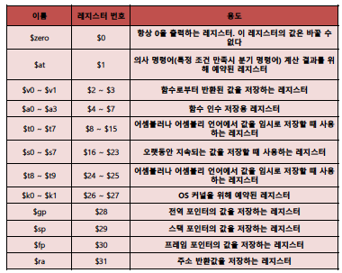

#### 스택프레임

- 함수가 실행될때마다 자신만의 고유한 stack영역을 가질 수 있다
- 함수의 스택프레임 시작저은 fp가 가르킨다.
- 함수의 종료시에 해제되고 리턴주소로 복귀한다.
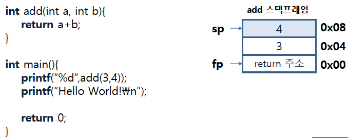

#### 고급언어와의 관계

- A = B + C;
- D = A - E;

- A~E는 $s1 ~$s5에 저장되어 있다고 가정
- add $s1, $s2, $s3
- sub $s4, $s1, $s5

## 피연산자

#### 피연산자(operand) 개요

- 연산자의 정의된 연산을 하기위하여 사용되는 레지스터나 상수, 레이블, 메모리주소 등을 뜻하는 말
- 레지스터는 데이터를 저장하는 장치중 속도가 가장 빠른 장소이므로 일부 레지스터만 사용가능
- 더 적은 레지스터를 필요로 하는 순서로 연산을 함으로써 더 많은 피연산자를 레지스터에 할당할 수 있게 된다.
- 데이터 단위는 MIPS명령어 및 레지스터는 32비트로 구성되어 있음

#### 메모리 피연산자

- 프로그래밍 언어에는 단순 변수가 아닌 자료형이 존재(ex. 구조체, 배열)
- 레지스터는 소량의 데이터만 저장할 수 있기 때문에 나머지 데이터는 메모리(Heap, Stack)에 저장 후 주소에 접근하여 사용함
- 메모리와 레지스터간 데이터를 주고 받는 명령어를 데이터 전송명령어(Data Transfer Instruction)이라고 함

#### 적재 명령어

- 메모리는 주소가 인덱스의 역할을 하는 일차원 구조
- 메모리에서 레지스터로 데이터를 복사해 오는 데이터 전송 명령어를 적재(Load)라고 함
- 적재 명령어는 연산자(lw) + 값을 저장할 레지스터 + 메모리 접근에 사용할 상수 및 레지스터로 구성됨
- 4($s3) === [Memory address + 4]

#### 저장 명령어

- 적재와 바대로 레지스터에서 메모리로 데이터를 보내는 명령을 저장(store)이라고 함.
- 적재명령어와 같은 구조
- 연산자(sw) + 저장할 데이터를 가진 레지스터 + 메모리 주소 레지스터 및 상수(offset)의 조합

#### 수치연산

- 프로그램 연산에서 레지스터가 아닌 상수를 사용하는 경우
- 상수 필드를 갖는 산술 명령어를 사용시 메모리에서 적재하는것 보다 효율적
- 사용빈도가 높으면 상수를 명령어에 포함하는 것이 좋음(Common case fase)
- 연산자: addi(add와 같은 구조)

## 부호

#### 컴퓨터의 숫자표현

- 컴퓨터는 높고 낮음만이 존재하는 디지털 신호(클럭 펄스)형태의 2진 숫자체계를 사용.
- 진법을 나타내는 기본수를 기수라고 함.
- 123(기수 10), 1101(기수 2)
- 모든 정보는 비트(bit)로 구성됨.
- 이진수의 십진수 변환 MIPS word길이는 32bit이므로 2의 32승 -1까지 표현 가능

#### 음수의 표현

- A > B 일때 A - B은 음수
- 컴퓨터는 양수와 음수를 전부 사용함
- 부호를 표현하기 위하여 2의 보수를 사용함

#### 보수(역 부호화)

- 양수에 대한 음의 값
- 1의 보수 : NOT(전체비트)
- 2의 보수 : 1의 보수 + 1(1의 보수는 0이 2개 존재)
- 2의 보수를 취하면 MSB(가장왼쪽에있는 비트)가 부호를 나타냄(부호비트)
  - 0일경우 양수
  - 1일경우 음수
- 범위 : -2,147,483,648 ~ 2,147,483,647

#### 오버플로우(Overflow)

- 덧/뺄셈 연산결과가 처리할 수 있는 최대 비트수를 초과 하였을 때 발생
- 더하거나 빼는 두수의 부호가 동일하며 결과가 반대부호일때 

## 명령어의 컴퓨터 내부 표현

#### 명령어의 해석방법

- 명령어도 높고 낮은 전기신호의 연속이므로 숫자로 표현하는 것이 가능
- 레지스터가 명령어에서 참조되기 때문에 레지스터 이름을 숫자로 매핑하는 규칙이 존재
- $s0 ~ $s7 == 16 ~ 23
- $t0 ~ $t7 == 8 ~ 15

#### 어셈블리어의 기계어 변환
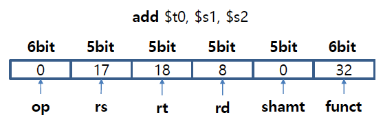

- 명령어의 각 부분을 필드(filed)라고하고 위와 같은 형식을 명령어 형식이라고 함
- 기계어는 보통 16진수를 사용하여 표현함
- op : 명령어가 실행할 연산의 종류로서 연산자(opcode)라고 한다.
- rs : 첫번째 근원지(Source) operand 레지스터
- rt : 두번째 근원지 operand 레지스터
- rd : 목적지(Destincation) 레지스터. 연산결과가 기억됨.
- shmat : 자리이동(shift)량 shift 명령어를 배우기 전까지 0으로 사용
- funct : op코드에 표시된 연산의 구체적인 종류 지정

#### 기계어 코드표
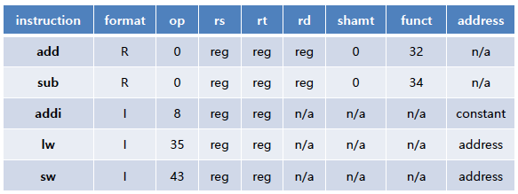

- R 타입 : 오른쪽 절반 필드가 3개일 경우
- I 타입 : 오른쪽 절반 필드가 1개일 경우
- address는 16비트 주소
- 명령어 형식이 여러가지가 되면 복잡해지지만 유사하게 설계하므로써 복잡도를 낮춤

## 논리명령어

#### 논리명령어의 정의

- 논리 명령어란 And, Nor, Or 등의 논리연산을 하기 위한 명령어
- 초기의 컴퓨터는 워드 전체에 대한 처리에만 관심을 가졌으나 비트 일부나, 비트 개개에 대한 연산이 필요하다는 것을 깨달음
- 비트들을 워드로 묶는 packing, 워드를 비트단위로 나누는 unpacking 작업을 수행

#### 논리명령어 종류

- sll : << : 비트를 왼쪽으로 이동시킴
  - 만약 지정된 비트수를 넘겼을 경우 최상위 비트는 버려짐
- srl : >> : 비트를 오른쪽으로 이동시킴
  - 만약 지정된 비트수를 넘겼을 경우 최하위 비트는 버려짐
- and, andi : & : 비트간 and 연산
- or, ori : | : 비트간 or 연산
- nor : ~ : Not, Or 연산

## 판단을 위한 명령어

#### 조건부 분기

- 컴퓨터와 단순 계산기의 차이점 : 판단 기능
- 입력데이터나 연산 결과에 따라 다른 명령어 실행가능
- 고급언어 예시 : if, go to, switch-case
- switch-case 문은 if-then-else 의 반복
- MIPS에서 가장 간단하게 switch-case를 구현하는 방법은 if-then-else를 사용하는 것

#### 조건부 명령어

- beq(branch if equal) : 비교 레지스터값이 같을 경우 L1으로 분기
  - beq register1, register2, L1
- bne(branch not equal) :비교 레지스터 값이 다를 경우 L1으로 분기
  - bne register1, register2, L1

#### 반복문(loop)

- 계산의 반복적인 수행을 위하여 instruction의 순환이 반드시 필요함
- 고급언어 예시 : for, while

#### 대/소 의 비교

- Equal, Not Equal외에 변수간의 대/소 비교가 존재함
- slt, slti 명령어를 이용하여 비교가능
- 첫번째 근원지 레지스터와 두번째 근원지 레지스터를 비교하여 첫번째가 작을 경우 목적지 레지스터를 1로 아닐경우 0으로 셋팅
- 부호없는 수끼리의 비교는 sltu, sltiu를 사용

## 프로시저

#### 프로시저란?

- 프로시저란 제공되는 인수에 따라서 특정작업을 수행하는 서브루틴
- 프로시저의 인수(parameter)는 프로시저에 값을 보내고 결과를 받아옴
- 프로시저나 함수는 재사용 가능하도록 프로그램을 구조화

#### 프로시저 관련 레지스터

- $a0-$a3 : 전달할 인수를 가지고 있는 인수 레지스터
- $v0-$v1 : 반환되는 값을 갖게 되는 값 레지스터
- $ra : 복귀주소(return address)를 가지고 있는 레지스터

#### 프로시저를 위한 명령어

- jal(jump-and-link instruction)
- 복귀주소를 $ra에 저장하고 프로시저가 할당된 주소로 점프하는 명령어
- $ra의 주소로 복귀할 때 jr(jump register)명령어를 사용
- EX> jal procedure address, jr $ra

#### 프로시저의 실행단계

- 프로시저가 접근 할 수 있는곳에 인수를 넣는다.
- 프로시저로 제어를 넘긴다.
- 프로시저가 필요로하는 메모리 자원을 획득한다.
- 필요한 작업을 수행한다.
- 호출한 프로그램이 접근할 수 있는 레지스터에 결과 값을 넘긴다.
- 호출한 프로그램으로 제어원을 반환한다.

#### 스택(Stack)

- 레지스터가 부족한 경우에 사용
- 선입후출로 이루어진 선형 자료구조
- push, pop으로 데이터를 넣고 꺼낼 수 있다.
- 스택포인터(sp)의 값은 스택에서 데이터가 들어가고 나올때마다 변경된다.
- 스택은 높은주소에서 낮은 주소로 생성되기 때문에 스택을 할당 할 때에는 sp에서 사용할 만큼의 값을 감소 시켜야함.

#### 스택프레임

- 각 프로시저는 독립된 스택프레임을 가지고 있음
- 프로시저의 저장된 레지스터와 지역변수를 가지고 있는 스택영역
- 프레임포인터(fp)가 프로시저의 첫 번째 워드를 가리키도록 되어 있음
- fp는 베이스레지스터의 역할을 하고 sp는 값이 변경되며 스택의 최하단을 가리킴
- 재귀호출등에서 ra값이 변경될 여지가 있으므로 복귀주소 저장 수단으로 스택프레임을 사용함.

#### 세그먼트(segment)

- 메모리는 각각 다른 값을 저장하는 블록으로 나누어져 있음
- stack : 지역변수 선언, 정적할당, 프로그램 종료시 자동소멸
- heap : 동적으로 할당된 메모리영역, 개발자가 해제를 해줘야함.
- Segmentation Fault : 참조할 수 없는 메모리영역을 참조했을 때 나오는 에러
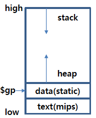

## 주소지정방식

#### MIPS 주소지정방식

- 수치 주소지정 : 피연산자는 명령어 내에 있는 상수
- 레지스터 주소지정 : 피연산자는 레지스터
- 베이스 레지스터 주소지정 : 메모리 주소는 베이스 레지스터의 값과 주소 필드의 변위 값을 더해서 구한다.
- PC 상대 주소지정 : PC값과 명령어 내 상수의 합을 더해서 주소를 구한다.
- 의사직접 주소지정 : 명령어 내의 26비트를 PC의 상위 비트들과 연접하여 점프주소를 구한다.

#### 수치 주소지정

- 명령어의 주소 필드에 데이터가 들어 있으며 상수의 정의나 변수 값의 초기화에 편리하다.
- 데이터를 얻기 위한 기억장치 접근이 필요 없으므로 명령어 사이클 한개가 적음
- 사용할 수 있는 수의 크기가 주소필드의 크기로 제한됨.
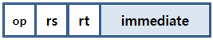

#### 레지스터 주소지정

- CPU내의 레지스터에 데이터가 저장되는 방식
- 주소 필드가 레지스터 번호를 나타내므로 적은 비트수가 필요함
- 데이터 저장공간이 CPU 내부 레지스터로 제한
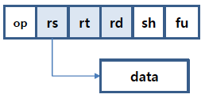

#### 베이스 레지스터 주소지정

- 베이스 레지스터의 값과 주소필드의 변위 값을 더해서 주소를 구함
- 피연산자가 메모리에 존재하고 있음
- 메모리 자원을 사용하므로 저자형식이 유연함.
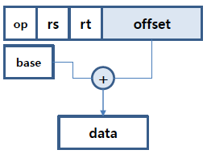

#### 상대 주소 지정

- PC(Program Counter)의 값에 명령어의 주소 필드의 값을 더해서 유효주소를 구하는 방식
- 적은 비트를 사용하는 것으로 32비트 분기주소를 만드는 것이 가능함.
- 조건부 분기명령에 사용됨.
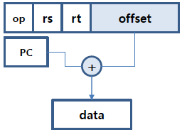

#### 의사 직접 주소 지정

- 명령어 내의 26비트를 PC의 상위 비트들과 연접하여 점프 주소를 구한다.
- 무조건 분기문에서 주로 사용됨.
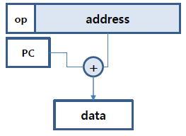

#### 32비트 상수 operand

- 프로그램에서 사용하는 상수는 대체로 작은 크기
- MIPS는 레지스터를 16비트씩 나누어 상수를 저장하는 것이 가능.
- lui(load upper immediate) : 레지스터 상위 16비트에 상수를 저장

## 컴퓨터 연산

#### 곱셈

- 피승수(multiplicand) : 곱함을 당하는 수
- 승수(multiplier) : 곱하는 수
- 곱(product) : 곱셈의 결과 값
- MIPS에서는 곱셈의 오버플로우 방지를 위하여 32비트 레지스터 2개를 지원함(총 64 비트)
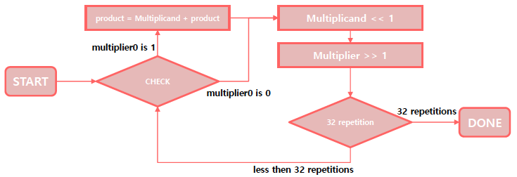

#### 나눗셈

- 피제수(dividend) : 나누어지는 수(분수의 분자에 해당)
- 제수(divisor) : 나누는 수(분수의 분모에 해당)
- 몫(quotient) : 나눗셈의 결과
- 나머지(remainder) : 피제수 - (제수 * 몫)
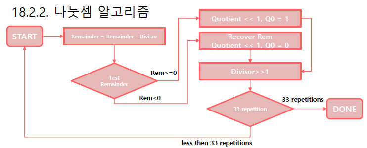

## 부동소수점

#### 소수
- 소수란 1의 자리보다 작은 자릿값을 가진 수를 의미
- 0.1, 0.2, 0.5 등
- 소수 표현 방식에는 고정소수점과 부동소수점이 존재

#### 고정 소수점
  - 고정 소수점은 소수점을 이용하여 고정된 자리수의 소수를 표현하는 방식
  - 밑수와 지수값을 미리 결정해두고 사용
  - 정수 자료형에 대해서는 연산이 굉장히 빠름
  - -3.75 —> 1011.1100
  - 부호를 제외한 나머지 비트를 절대값으로 나타내는 방식
  - 소수부는 첫째자리부터 2의 -1승으로 시작하여 자리수가 늘어날 때마다 그값이 2분의1이 됨

#### 고정 소수점의 문제점

- 고정된 자리수 때문에 한정된 메모리에서 좁은 범위의 수만 나타낼 수 있음
- 소수점 고정 문제로 인해 소수를 표현하는 비트가 정수를 침해할 가능성이 존재함.
- 소수를 표현하는데에 있어 정밀도가 부족함

#### 부동 소수점

- 부동소수점 표현방식은 소수를 부호, 가수, 밑수, 지수로 표현하는 방식
- 132.12234 -> 0.12312234 * 10의3승
- 위와 같은 방법을 이용하면 더 많은 수를 표현할 수 있게됨
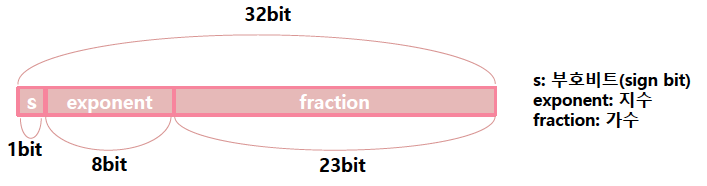

#### IEEE 754 정규화

- 컴퓨터가 처리하는 모든 소수는 가수부 최상단 비트가 1로 표현되는 일관성 있는 형태를 유지하고 있음
- 이를 정규화형식(Normalized form)이라고 함.

#### 바이어스(bias)

- 소수의 정규화시 지수부가 음수가 될 가능성이있음
- Ex) 0.001 -> 1.0 * 10의 -3승
- 지수비트에는 부호비트가 없기 때문에 바이어스 표기법을 사용(지수 -127부터 128까지 사용가능)
- 0000 0000 = -127
- 0111 1111 = 0

#### 정밀도 문제

- 23비트 가수표현은 자리수가 긴 소수 표현에 적합하지 않음
- 32비트의 2배인 64비트 레지스터를 사용하는 2배 정밀도 부동소수점 표기방식이 출현
- 1비트 부호, 11비트 지수, 52비트 가수 표현방식
- 2배 정밀도 바이어스 : 1023