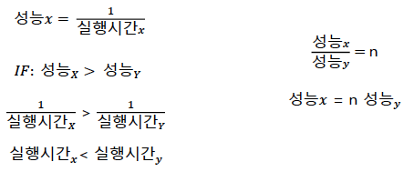

## 컴퓨터란?

#### 컴퓨터란?

- 컴퓨터는 어떤 일을 할 수 있을까?
  - 복잡한 계산(미적분, 통계)
  - 처정밀 그래픽 구현
  - 네트워크 통신

#### 컴퓨터의 역사

- 고대
  - 계산을 하는 도구로서 가장 처음 만들어진 주판
  - 기원전 약 3000년전 고대 메소포타이마에서 사용
  - 17세기에 이르도록 주판이 이용됨
- 중세
  - 1642년 프랑스 수학자 파스칼이 톱니바퀴를 이용한 계산기 발명
  - 최초의 기계식 계산기
  - 기어로 연결된 바퀴판틀로 덧셈과 뺄셈 동작가능
  - 1681년 독일의 라이프니츠가 이를 개량해 곱셈과 나눗셈도 가능한 계산기 발명
- 근현대
  - 19세기 중반 영국의 찰수 배비지가 차분엔진을 발명
  - 차분엔진은 현대 컴퓨터의 개념을 처음으로 제시함
  - 차분기관과 해석기관을 설계하여 제어, 연산, 기억, 입출력이 가능하였음.
  - 프로그램과 데이터로 구성된 입력에는 천공 카드를 사용하였음
  - 1930년대에 들어서 앨런 튜링, 알론조 처치 등이 계산 가능성 및 불가능성에 대하여 연구
  - 이를 기반으로 튜링머신 탄생
  - 튜링머신은 긴 테이프에 부호를 기록하여 이를 프로그램처럼 사용하였음.
  - 1942년 독일의 콘드라 추제가 Z3발명
  - 1945년 폰 노이만이 stored-program architecture를 제안
  - 1946년 미국의 ENIAC 제작
- 현대
  - 1960년대 : 초기의 다목적 컴퓨터 IBM 시스템/360 개발
  - 1970년대 : Thompson과 Ritchie가 Unix와 C개발
  - 1970년대 : Intel 8008 프로세서 개발
  - 1980년대 : Intel 프로세서와 MS-DOS를 사용하는 IBM PC 등장 및 GUI와 마우스를 사용하는 애플 매킨토시 등장
  - 1990년대 : Linux Torvalds가 Linux를 개발, Microsoft의 Windows가 등장, 인터넷 포탈(야후,구글)등의 등장
  - 2000년대 
    - 컴퓨터를 활용하여 인간 DNA 30억 염기서열을 밝히는 Genom Project
    - 애플의 iPhone을 필드로 스마트폰이 쏟아져 나옴
    - 빅데이터, 인공지능의 시대

## 컴퓨터 구조 분야의 8가지 아이디어

#### 8가지 아이디어

- 무어(Moore)의 법칙을 고려한 설계
  - 인텔의 창립자 중 한명인 고든 무어의 예측에서 유래
  - 18~24개월 마다 칩에 집적되는 소자의 수가 2개가 된다는 법칙
  - 컴퓨터를 설계하는 데에는 수년이 걸리기 때문에 집적되는 소자의 수가 2개 내지 4개가 증가함
- 설계를 단순화 하는 추상화
  - 무어의 법칙에 따라 자원의 수가 급격하게 증가함
  - 설계시간이 길어짐으로써 생산성이 낮아짐
  - 생산성을 높이기 위하여 추상화 개념을 사용
  - 하위 수준의 상세한 사항을 안보이게 함으로써 상위 수준 모델을 단순화
- Common case fast
  - 자주 발생하는 일을 빠르게 처리하여 성능 향상도모
  - Common case에 대한 최적화 및 단순화
  - Common case가 무엇인지 알고 있다는 가정
  - Common case에 대한 세심한 실험과 측정 필요
- 병렬성을 통한 성능개선
  - 컴퓨터 역사 초기부터 설계자들은 병렬성을 높여 성능을 끌어 올렸다.
  - 병렬성이란 큰문제를 여러개의 작은 문제로 나누어서 해결하는 방법 : 쓰레드
- 파이프라이닝을 통한 성능개선
  - 파이프라이능은 병렬성의 특별한 형태
  - 처음단계 출력이 다음 단계 입력으로 이어지는 구조
  - 화재를 진압하기 위해서 많은 사람들이 일렬로 늘어서 양동이를 나르는것
- 예측을 통한 성능 개선
  - 수요가 예상되는 부분을 예측
  - 복구비용이 낮고, 성공확률이 높을 경우 효과적
  - 정확한 예측을 위한 지표가 필요함
- 메모리 계층 구조
  - 메모리 계층구조를 통한 문제해결
  - 최상위 - 비싸고 제일 빠른 메모리
  - 최하위 - 느리고 값이 싼 메모리
- 여유분을 이용한 신용도 개선
  - 컴퓨터는 신뢰할 수 있어야함
  - 장애대처를 위한 여유분 준비
  - 데이터 손실 예방을 위한 백업과 같은 이치

## 컴퓨터의 구성요소 및 역할

#### 컴퓨터의 구성요소

- 입력(Input)
  - 데이터를 메모리에 씀
- 출력(Output)
  - 메모리로부터 데이터를 읽음
- 메모리(Memory)
  - 실질적으로 데이터 저장되는 공간
- 프로세서
  - 메모리로 부터 명령과 데이터를 얻음
  - 제어유닛은 프로그램 명령에 따라서 데이터패스, 메모리, 입/출력의 동작을 결정함
    - 데이터패스(Data Path)
    - 제어유닛(Control)

#### 프로세서의 역할 : CPU

- 메모리로 부터 명령어를 받아와 제어신호를 생성
- 컴퓨터 명령어(기계어)를 해석하고 연산함
- 컴퓨터 기술을 이끄는 원동력
- 인간의 두뇌와 같은 역할

#### 프로세서의 역할 : GPU

- 픽셀로 이루어진 영상을 처리하는 용도로 탄생
- 싱글코어는 CPU보다 저성능이지만 병렬적인 수천개의 코어가 연결되어 있음
- 인공지능 기술발전의 선도주자

#### 프로세서의 동작과정

#### 메모리의 역할

- 명령어(프로세스) 및 데이터 적재
- 정보를 저장해 두었다가 필요할 때 읽어들이는 저장소
- 레지스터의 용량이 너무 작아서 출시됨.
- RAM, ROM, 캐스 등

## 기계어와 어셈블리어 고급언어

#### 프로그램의 형태

- 프로그램은 무엇인가?
- 컴퓨터는 어떻게 프로그램을 이해하는가?
- 프로그램이 구동될때 하드웨어는 어떤 동작을 취하는가?

#### 고급언어

- 일반적으로 언급되는 프로그래밍 언어
- C, Python, Java
- 고급언어를 컴파일러가 어셈블리어로 번역

#### 어셈블리어

- 컴파일러로 부터 생성된 어셈블리어는 기계가 이해할 수 있는 형태로 번역됨
- 기계사고방식의 언어
- 어셈블러는 어셈블리어를 기계어로 번역

#### 기계어

- 기계어는 기수가 2인 숫자로 구성됨
- 숫자 단위 하나는 비트(bit)
- 컴퓨터가 이해할 수 있는 비트들의 집합

## CPU 성능

#### 성능의 정의

- 시간과 리소스에 대응되어 컴퓨터 시스템이 수행하는 작업의 양
- 성능 측정척도는 다양하다
- 개인사용자 : 응답시간, 데이터센터 관리자 : 처리량

#### 성능의 척도 : 응답시간

- 작업개시에서부터 종료까지의 시간
- 디스크 접근, 메모리 접근, 입출력 작업, 운영체제 오버헤드, CPU연산시간 등을 포함

#### 성능의 척도 : 처리량

- 단위 시간당 처리할 수 있는 태스크의 양
- 응답시간과 다른 척도로 시스템 성능을 평가할때 사용

#### 성능과 실행 시간관의 관계

#### 클럭(Clock)

- 하드웨어 이벤트가 발생하는 시점을 결정
- 클럭 사이클 : 클럭의 시간 간격
- 클럭 속도 : 클럭 사이클의 역수

#### CPU 성능과 성능인자

- 궁극적인 CPU성능 척도는 CPU 시간
- 프로그램의 CPU 실행시간 = 프로그램의 CPU 클럭 사이클 수 / 클럭 속도
- 클럭사이클 수 = 명령어수 X 명령어당 평균 클럭 사이클 수(CPI)
  - CPI(Clock cycle Per Instruction) : 명령어 하나의 실행에 필요한 평균 클럭 사이클 수

## 전력

#### 전력이란

- 컴퓨터가 동작하는데에 소비되는 전기의 힘
- 전력과 클럭속도는 밀접한 관계가 있음
- CPU온도가 낮아지면 전력소모가 줄어듬
- 파워서플라이를 통해 전력을 공급받음

#### 전력사용 주 원인

- 트랜지스터가 0에서 1로 혹은 그 반대로 스위칭하는 동안 소비
- 트랜지스터가 소비하는 전력은 스위칭시 소모되는 에너지와 시간당 논리값이 바뀌는 빈도수의 곱

#### 전력의 문제점

- 전앞을 낮추면 트랜지스터 누설 전류가 커짐
- 전력이 너무 높아지면 온도 또한 올라감(냉각 비용발생)

