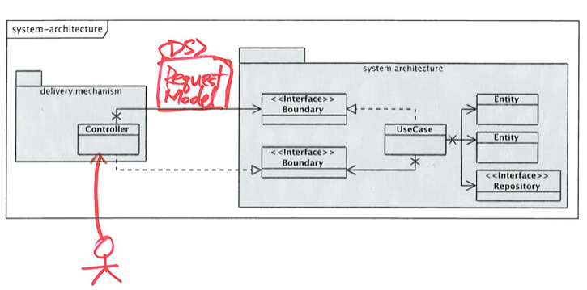
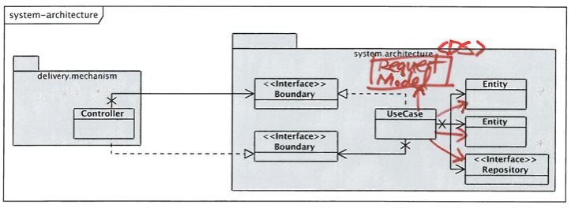
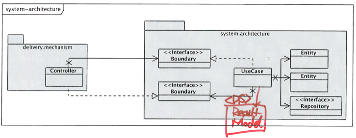
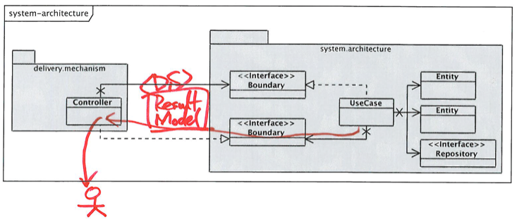

# Architecture

- Architecture란 툴,Building Material(Java,Spring ..) 등이 아니라 사용법(Usage)에 대한것이다.

## Developing Domain Model
1. 클래스/속성/관계 식별
    - 도메인 영역의 주요 개념(명사)를 식별
    - 초기 도메인 모델은 클래스,클래스의 속성, 클래스들 간의 관계를 갖는다.
2. 도메인 모델에 행위 추가하기
    - 도메인 모델에 행위를 추가함으로써 도메인 모델에 생명력을 부여
    - 도메인 모델의 행위를 결정하기 위해 도메인 모델의 책임(Responsibility)과 상호작용(Collaboration)을 식별
    - 클래스의 책임 : 클래스가 아는것(속성,관계), 하는 것, 결정하는 것등
    - 클래스의 상호작용 : 책임수행을 위해 호출하는 다른 클래스들

### 책임과 상호작용을 식별하는 절차
1. 요구사항 식별하기
    - 처리해야 할 요구사항 식별/어떻게 응답할 지 결정
    - UI디자인, 유스케이스, 유저스토리 등을 분석해서 요구사항은 2가지 부분으로 구성 : 사용자 행위, 사용자행위 요청에대한 어플리케이션의 응답(책임)
    - 어플리케이션의 책임은 2가지로 그룹핑 : (사용자 입력 검증, 값계산, 데이터베이스 갱신), 값 출력     
2. 메소드 식별하기
    - 각 요청에 대해 2가지 메소드들이 존재 : 서비스 메소드(사용자 요청 검증, 계산수행, 데이터베이스 갱신), 리파지토리 메소드(출력을 위한 데이터 변환)
    - 도메인 모델의 클라이언트는 도메인 티어를 2번호출 : 서비스 메소드 + 리파지토리 메소드
3. TDD로 메소드 구현하기
    - 대상 서비스 메소드에 대해 하나 이상의 테스트케이스를 작성하는 것으로 시작 : 각 테스트케이스는 서로 다른 상황을 재현하기 위해 다른 인자로 구성된다.
    - mock객체를 이용해서 : (서비스메서드 -> 리파지토리 메소드 순으로 top-down방식으로 구현), 구현을 하다가 발견되는 collaborator를 구현하기 위해 머릿속에서 context-switching이 일어날 필요가 없어서 집중하면서 구현

## Use Cases
- Delivery 문제를 우아한 아키텍쳐로 해결
- Delivery와 무관한 방식으로 사용자가 시스템과 상호작용하는 방식을 이해하는 것
- 링크, 버튼, 클릭 등의 용어를 사용하지 않고 표현
- Delivery 메커니즘을 나타내지 않는 용어를 사용
- 제이콥슨은 이런 상호 작용을 Use Case라고 했다.
- 어플리케이션 개발은 Delivery와 독립적인 Use Case에 의해 주도되어야 한다.
- use case가 시스템에서 가장 중요한 것

### 야콥슨의 Partitioning - Flow
#### Delivery 메커니증
- 사용자 요청 수집
- 요청을 표준적인 형식(RequestModel)으로 표현
- Boundary를 통해 RequestModel을 Interactor에 전달
   

#### Interactors
- Applications 특화된 비지니스 로직 수행
- Entity를 조작하여 Application 독립적인 비지니스 로직 수행
     
- 결과를 수집, 표준적인 형식(ResultModel)로 생성
  
- Boundary를 통해 다시 Delivery메커니즘으로 전달
 

