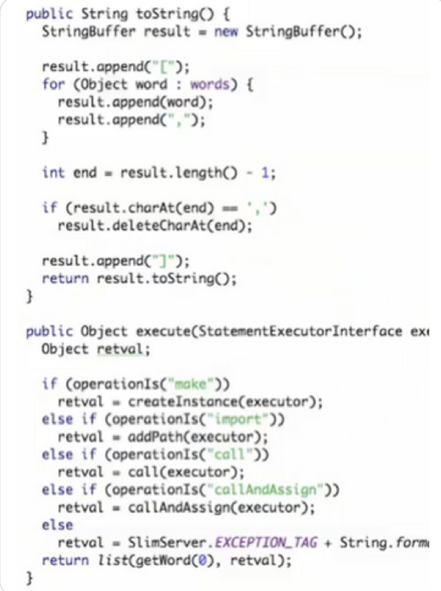

# Forms

## Coding Standards
- 조직이 커지면서 코드에대한 기본은 스타일을 필요하다
- 문서는 필요하지 않고 코드에 녹여있어야한다.

## Comment
- 작성자의 의도가 잘나타나게 프로그램을 작성하게 되면 주석은 불필요함.

## Good Comment
1. legal comment

2. impormative comment

3. waring consequences

4. Todo comment

5. public API Document

## Bad Comment

1. Redundant Explanations

2. Mandated Redundancy

3. Journal Comments

4. Noways Comments 

5. Big banner Comments

6. Closing brace Comments 

7. Attribution comments

8. Non local Infomation

-  멀리 떨어진 곳의 코드를 설명하는 커멘트는 커멘트와 무관하게 변경될수 있다. 

## Vertical Formmatting
공란을 함부로 사용하지 마라

1. 메소드 사이
2. private변수들과 public 변수들 사이
3. 메소드 안에서 변수선언과 메소드 실행의 나머지 부분 사이
4. 메소드 안에서 if/while 블록과 다른 코드 사이

