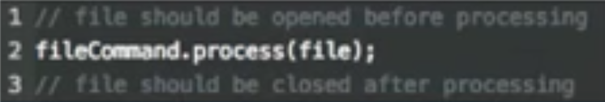
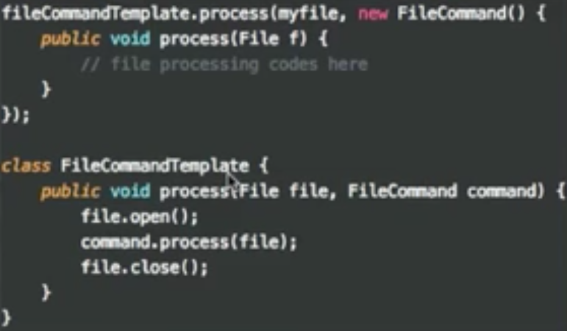

# Function Structure

## Arguments
1. 인자가 많아지면 복잡도가 증가하여 최대 3개까지만 갖는다. 그 이상이면 Object로 넘겨준다.
2. 생성자에 많은 수의 인자를 넘겨줘야한다면 Builder패턴을 적용 한다.  


3. Boolean 인자를 사용금지 
	- 2가지일을 해야되는 것이기때문에 2개의 함수로 분리

4. 인자로 받은값을 리턴값으로 사용하지 마라.
5. null 을 인자값으로 넘기지 마라	

## The Stepdown Rule
1. 모든 public은 위에 private는 아래에 위치 시켜라
	- private한 상세내용은 안봐도 상과없다. 

## switches and cases

### 객체지향의 가장 큰 이점 중 하나는 의존성 관리능력이다.

#### 모듈A가 모듈B의 함수를 사용하는 경우

- 독립적으로 배포/컴파일/개발 불가
#### 객체지향이 가능케하는 것

- runtime 의존성은 그대로 둔채로 source code의존성을 역전시킴

##### 절차
1. 본래의 의존성 제거
2. polymorphic interface를 삽입
3. 모듈A는 인터페이스에 의존하고, 모듈 B는 인터페이스를 구현한다.

### switch 문장은 독립적 배포에 방해가 됨.
#### switch문장 제거 절차
1. switch문장을 polymorphic interface호출로 변환
2. case에 있는 문장들을 별도의 클래스로 추출하여 변경영향이 발생하지 않도록 한다. 

- 실습URL : https://github.com/msbaek/videostore


## Temporal Coupling
- 함수들이 순서들을 지키면 호출되어야 한다. 

예) open, execute, close 순서로



## CQS
- 상태를 변경하는 함수는 값을 반환하면 안된다.(Command)
- 값을 반환하는 함수는 상태를 변경하면 안된다.(Query)

```java
User u = auth.logn(id,pwd);

auth.logn(id, pwd); // Command
User u = auth.getUser(userName); // Query
```

## Tell Don't Ask
- 데이터를 물어보지 않고, 기능을 실행해 달라고 말하라
-  기능 실행을 요청하는 방식으로 코드를 작성하는 버릇을 들여야 한다.

## Law of Demeter
- 함수가 시스템 전체를 알게해서는 안된다. 
- 개별 함수는 아주 제한된 지식만 가져야 한다. 
```java
o.getX()
	.getY()
		.getZ()
			.doSomeThing();
// 위와 같으면 의존을 너무 가지기 때문에 함수를 여러개 만들어야한다.

doSomeThing() {
	getZ();	
}
getZ() {
	getY();
}
getY() {
	getX();
}			
```

## early returns
- 빨리 리턴시켜주는 것이 좋다. if-else 일 경우 if조건이 else보다 간단해야 한다. 
```java
private boolean nameInValue(name) {
	 if(name.equals("")) {
			return true;
	 }else {
			....
			return false;
	 }
	 return false
}
```

## Error handlering, Special Case

예제 : https://github.com/msbaek/stack-example

## 널은 에러가 아니다, 널이 값일 경우도 있다.

## try도 하나의 역할/기능이다.
- try에도 하나의 함수만 들어가야한다. 여러개가 들어가면 구조화가 잘못된 것이다. 