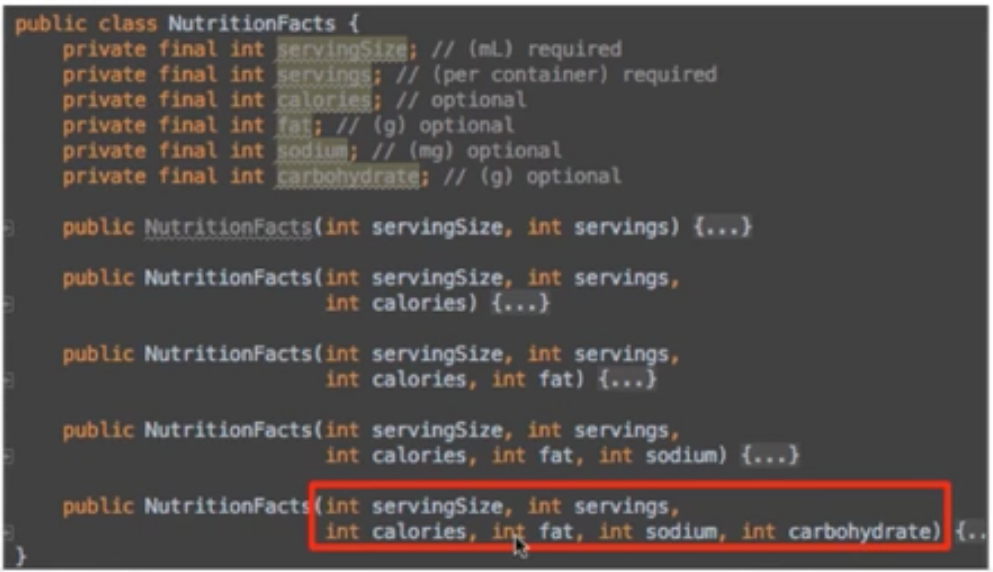
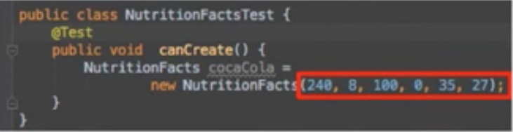
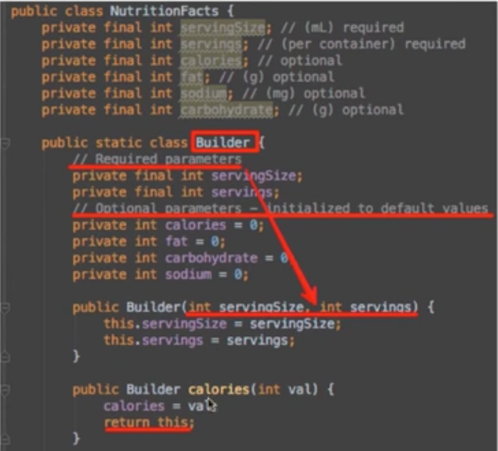
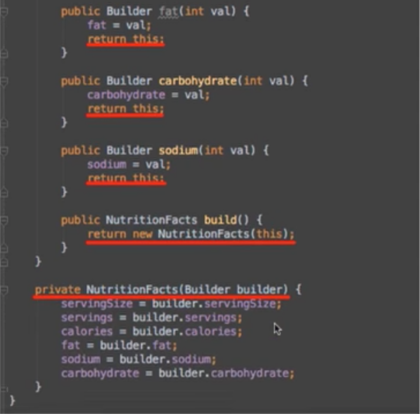
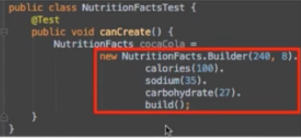
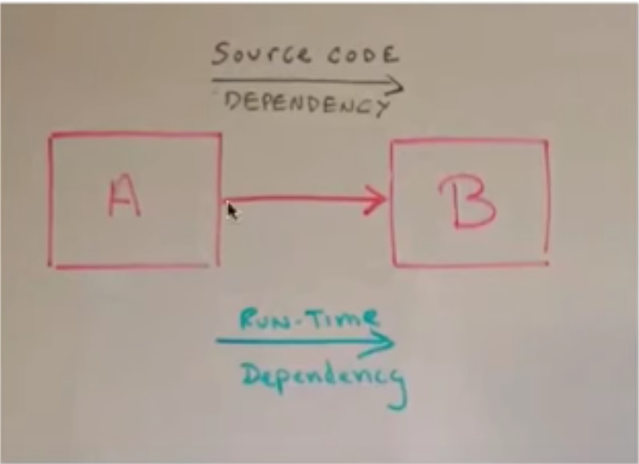
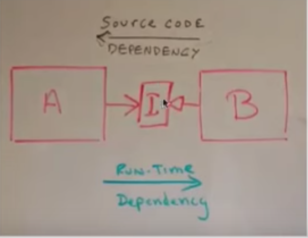

# Function Structure

## Arguments
1. 인자가 많아지면 복잡도가 증가하여 최대 3개까지만 갖는다. 그 이상이면 Object로 넘겨준다.
2. 생성자에 많은 수의 인자를 넘겨줘야한다면 Builder패턴을 적용 한다.  

3. Boolean 인자를 사용금지 
	- 2가지일을 해야되는 것이기때문에 2개의 함수로 분리

4. 인자로 받은값을 리턴값으로 사용하지 마라.
5. null 을 인자값으로 넘기지 마라	

## The Stepdown Rule
1. 모든 public은 위에 private는 아래에 위치 시켜라
	- private한 상세내용은 안봐도 상과없다. 

## switches and cases

### 객체지향의 가장 큰 이점 중 하나는 의존성 관리능력이다.

#### 모듈A가 모듈B의 함수를 사용하는 경우

- 독립적으로 배포/컴파일/개발 불가
#### 객체지향이 가능케하는 것

- runtime 의존성은 그대로 둔채로 source code의존성을 역전시킴

##### 절차
1. 본래의 의존성 제거
2. polymorphic interface를 삽입
3. 모듈A는 인터페이스에 의존하고, 모듈 B는 인터페이스를 구현한다.

### switch 문장은 독립적 배포에 방해가 됨.
#### switch문장 제거 절차
1. switch문장을 polymorphic interface호출로 변환
2. case에 있는 문장들을 별도의 클래스로 추출하여 변경영향이 발생하지 않도록 한다. 

- 실습URL : https://github.com/msbaek/videostore

