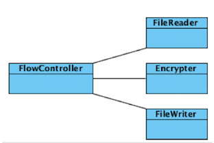
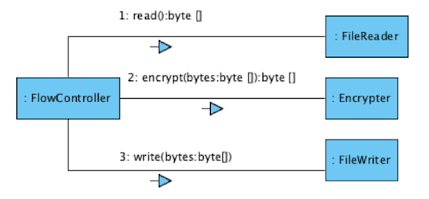
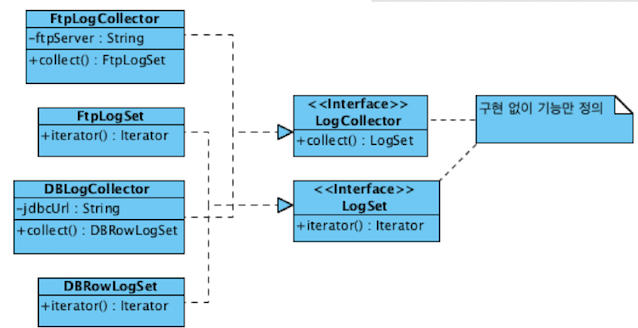
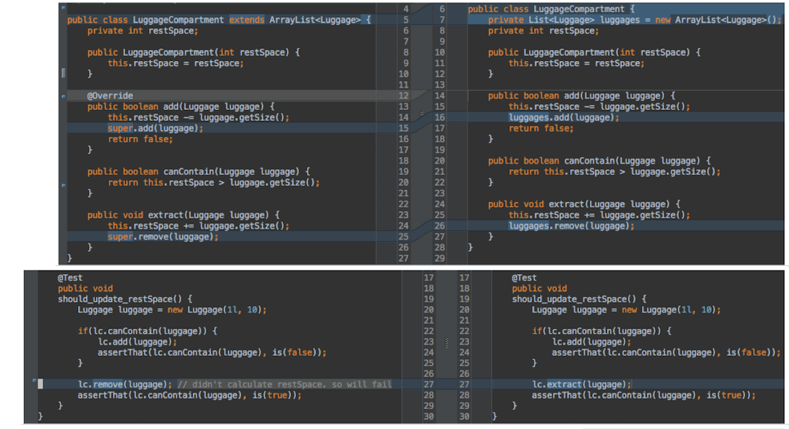

# OOP

## 왜 클린코드인가?
기계가 이해할 수 있는 코드는 어느 바보도 작성할수 있다. 하지만 인간이 이해할 수 있는 코드는 잘 훈련된 소프트웨어 엔지니어만이 작성할 수 있다. 

SW는 한번 작성되면 최소 10번 이상 읽힌다. 그래서 대충 돌아만가게 작성하면 안되고 읽기 편하도록 작성해야 한다.

## Why OOP
※ 절차지향은 데이터를 중심으로 한 프로시저로 구성되어 있다.
- 초기 진입은 쉬우나 Data의 변경이 많은 영향을 끼쳐서 변경의 어려움이 있다. 

※ 객체지향은 데이터 및 데이터와 관련된 프로시저를 객체라고 불리는 단위로 묶는다.
- 데이터와 코드가 캡슐화되어있고 데이터와 그 데이터를 조작하는 코드의 변경은 외부에 영향을 미치지 않는다.
- 외부에 노출된 인터페이스만 변경되지 않는다면 프로시저를 실행하는데 필요한 만큼의 데이터만 가진다.

## Object / Role / Responsibility
※ 객체/클래스 이름은 정할때는 어떻게(JsonRequestParser)로 정의하지 말고 무엇(RequestParser)으로 정의해야한다. 
※ 역할은 관련된 책임의 집합을 의미 하며 객체는 역할을 가지고 있다. 

## 객체지향 설계 과정 
1. 기능을 제공할 객체 후보 선별
	- 내부에서 필요한 데이터 선별
	- 클래스 다이어그램
	- 정적 설계
2. 객체간 메시지 흐름 연결
	- 커뮤니케이션 다이어그램
	- 시퀀스 다이어그램
	- 동적 설계
3. 1번과 2번을 반복

예제) 1번 기능을 제공할 객체 후보 선별
 	

2번 객체간 메시지 흐름 연결
 	

## Encapsulation(캡슐화)
※ 내부적으로 어떻게 구현했는지를 감춰 내부의변경(데이터,코드)이 client가 변경되지 않도록 하는 것(코드변경에 따른 비용 최소화)

예)
```java
// 절차지향
if(member.getExpiredDate().getTime() < System.currentTimeMillis){ }
// 객체지향 
if(member.isExpired()) {}

```

## Polymorphism(다형성)
※ 한 객체가 여러가지(poly) 모습/타입(morph을 여러개 가질수 있다. 

```java
ZetMotorcycle zm = new ZetMotorcycle(); // ZetMotorcycle 모습
Motorcycle mc = zm; // Motorcycle 모습
ZetEngine ze = zm; // ZetEngine 모습
```
상속을 통해 다형성 구현
- 구현 상속 : 수퍼타입의 구현을 재사용
- 인터페이스 상속 : 타입정의만 상속, 상속은 객체에게 다형성을 제공

## Abstraction(추상화)
※ 추상화란? 데이터/프로세스 등을 의미가 비슷한 개념/표현으로 정의하는 과정, 상세한 구현으로 부터 개념을 도출하는 과정
 	

※ 개발자들은 습성상 상세한 구현에 빠지다보면 상위 수준의 설계를 놓치기 쉽다.
- 파일읽어와 메모리에 저장하고, 한줄한줄 정규표현식으로 파싱하고, 그결과를 DB에 저장하기 의 구현이면
- 로그수집, 로그분석, 결과저장이라는 추상화를 통해서 상위 수준에서의 설계를 해야한다. 

※  객체지향적으로 사고를 바로 할수 없어서 바로 설계를 못하기 때문에 개발을 하다가 리팩토링을 하여 설계를 바꿔하는 방법을 한다. 

## Composition over Inheritance(상속보단 조립)

### 상속을 통한 재사용의 단점
1. 상위 클래스 변경의 어려움이 있다.
2. 유사한 기능을 확장하는 과정에서 클래스의 개수가 불필요하게 증가할수 있다.
3. 상속이 오용될수 있다. : 상속은 IS-A관계가 성립될 때에만 사용해야 하는데 그런 관계가 아닐때 사용한다.

### 조립을 이용한 재사용
 ※ 객체 조립(composition) : 여러 객체를 묶어서 더 복잡한 기능을 제공하는 객체를 만들어내는 것이다.

 ※ 상속보다는 객체 조립을 사용하는 것이 더 효과적이다.
 
 ※ 상속에 비해 조립을 통한 재사용의 단점은 상대적으로 런타임 구조가 복잡해진다. 그리고 상속보다 구현이 더 어렵다는데 있다. 하지만 장기적 관점에서 구현/구조의 복잡함보다 변경의 유연함을 확보하는 데서 오는 장점이 더 크기 때문에 기능을 재상용해야 할 경우 상속보다는 조립하는 방법을 먼저 고려해야 한다.
 
 ※ 위임(delegation) : 내가 할일을 다른 객체에 넘긴다는 의미를 담고 있으며, 보통 조립 방식을 이용해서 위임을 구현한다.

  

### 상속은 언제 사용하나?
 ※ 재사용이라는 관점이 아닌 기능을 확장이라는 관점에서 상속을 적용해야하고 명확한 IS-A관계가 성립 할때 사용한다.

