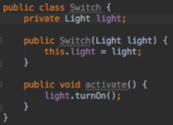

# SOLID

- 소프트웨어 공학의 결과물은? 소스코드(The source code is the design)  

## Design Smells
### Rigidity
- 시스템의 의존성으로 인해 변경하기 어려워지는 것
- Rigid하게 하는 원인
    - 많은 시간이 소요되는 테스트와 빌드
    - 전체 리빌드를 유발하는 아주 작은 변화

### Fragility
- 한 모듈의 수정이 다른 모듈에 영향을 미칠 때
- 해결책은 모듈간의 의존성을 제거하는 것

### Immobility
- 모듈이 쉽게 추출되지 않고 재사용 되지 않는 경우
- ex) 로그인 모듈이 특정 DB의 schema를 사용하고, 특정 UI skin을 사용하는 경우 : 이모듈은 다른 시스템에서 재사용하지 못할 것이다.
- 해결책은 DB, UI, Framework 등과 결합도를 낯추는 것

## 객체지향
- 객체지향은 실세계를 똑같이 모델링 하는 것
- Inheritance, Encapsulation, Polymorphism은 객체지향의 핵심이 아니라 메커니증
- 객제지향의 핵심은 IoC를 통해 상위 레벨의 모듈을 하위 레벨의 모듈로 부터 보호하는 것

## SRP(Single Responsibility Principle)  
- 클래스는 하나의 책임을 가져야 한다. 
- SRP는 사용자에 관한 것이어서 책임이란 SW의 변경을 요청하는 특정사용자들에 대해 클래스/함수가 갖는것으로 '변경의 근원'으로 불수 있다.

### 시스템 설계
- Actor 파악에 주의해야함
- Actor들을 serve하는 책임들을 식별
- 책임을 모듈에 할당 : 각 모듈이 반드시 하나의 책임을 갖도록 유지하면서 
- 분리의 이유 : 다른 이유로 인해 변경되고, 다른 때에 변경되기 때문

### Case Study

- Customer Actor를 위한 Responsibility가 어플리케이션 아키텍처의 중심
- 각 패키지는 각 액터들을 위한 책임을 구현
- 패키지 간의 의존성 방향에 주의

## OCP(Opem Closed Principle) 
### OCP 예)

- 디바이스가 추가되면 해당 디바이스를 담당하늨 클래스를 추가 : Open for extension
- 하지만 copy 로직의 수정은 발생하지 않는다 : Closed for modification

### De-Orderizing the Desing 예제

- 확장에는 열려있고 변경에는 닫혀 있는 부분은 Application 파티션에만 존재. 추상화에 의해 보호됨.
- 변경되어야 하는 부분들은 경게의 반대쪽인 main 파티션에만 존재

엉클밥소스 : https://github.com/unclebob/Episode-10-ExpenseReport

백명석 소스 : https://github.com/msbaek/expense

## LSP(Liskov Substitution Principle) 

### 예)

- OCP는 abstraction, polymorphism(inheritance)를 이용해서 구현 
- LSP는 OCP를 받쳐주는 polymorphism에 관한 원칙을 제공해준다. 
- LSP가 위반되면 OCP도 위반되다. 
- LSP를 위반하면 subtype이 추가될때마다 클라이언트들이 수정되어야 함.
- instanceof/downcasting 을 사용하는 것은 전형적인 LSP 위반의 징조

## ISP(Interface Segregation Principle) 
- 클라이언트 입장에서 인터페이스를 분리하라는 원칙(SRP와도 연관됨)

### Switch 예제

- Switch가 Light에 의존적임. Switch는 Light분 아니라 Fan, Motor 등도 turnOn할수 있다. 
- Switch는 Light에 대해서 알면 안된다.

- 위와 같이 해결하면 Light에 대한 의존성을 갖지 않는다.
- Switch와 Switchable이 같은 패키지/배포 단위
- interface(Switchable)는 클라이언트(Switch)에 속하고 구현체(Light)와 관련이 없다. 그러므로 인터페이스의 이름은 클라이언트와 연관된 것으로 지어야한다.

## DIP(Dependency Inversion Principle)  

### Dependency Inversion

- A와 B사이에 polymorphic interface를 삽입
- A는 uses interface
- B는 implements the interface
