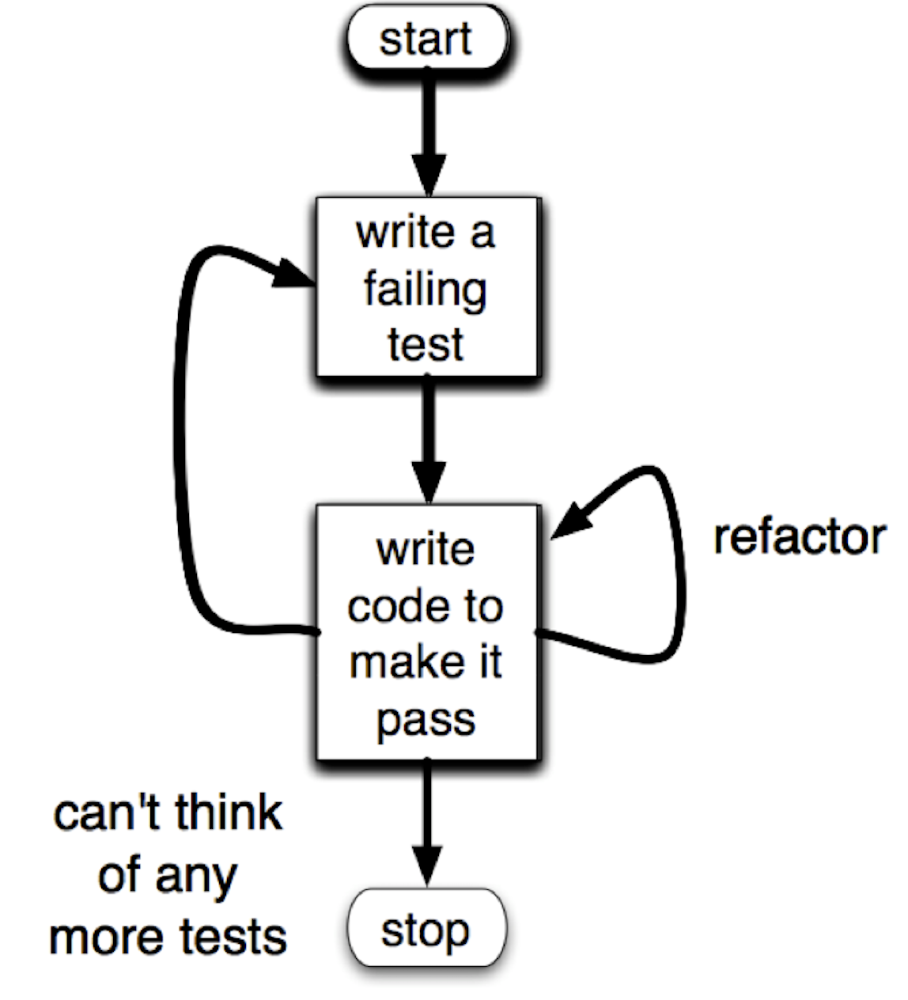

# TDD

## The Three Law of TDD
1. Write NO production code expect to pass failing test.
2. Write only ENOUGH of a test to demonstrate a failure
3. Write only ENOUGH production code to pass the test
## TDD 절차

## TDD를 사용하면 좋은점
1. 디버깅 시간을 줄여줄수 있다.
2. tdd 3단계를 잘지키면 설계문서를 얻을 수 있다. 
	- test는	low level design document 이다.
3. tdd로 개발하다보면 decouple된 시스템을 갖게 된다.
4. test가 있으면 로직 수정에 두려움을 느끼지 않는다. 

## 실습 

볼링게임 : https://github.com/msbaek/bowling-game

소인수 : https://github.com/msbaek/primefactors

wordwrap : https://github.com/msbaek/wordwrap