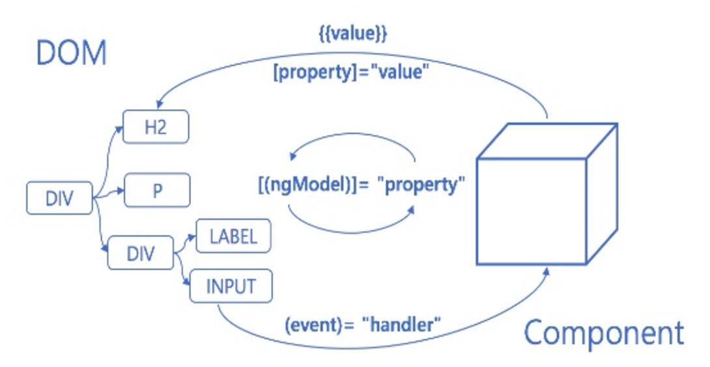

# Angular 첫걸음

영상주소 : https://www.youtube.com/watch?v=idUbhCegL9A#t=5446.159483195

문서자료 : https://www.slideshare.net/mediahanbit/angular-for-beginers/mediahanbit/angular-for-beginers

저자 github : https://github.com/not-for-me
저자 blog : http://www.notforme.kr/

## 주요개념 1 : Component
1. 컴포넌트는 View를 관리하는 컨테이너와 같다.
2. Angular App은 컴포넌트 트리를 반드시 갖는다.
3. 컴포넌트 트리의 최상위 루트 컴포넌트를 관례적으롤 AppComponent라고 한다. 
4. View 컴포넌트를 나누는 기준은 없다. 
	- 재사용성
	- 페이지 단위

## 주요개념 2 : Template
1. View를 구성하는 Angular-style 마크업
2. View를 구성하기 위핸 Component와 짝을 이룸
3. Html을 포함한 Angular에서 제공하는 다양한 연산자 및 syntax를 사용하여 View를 구성하는 코드를 작성

## 주요개념 3 : Component Lifecycle


## 주요개념 4 : Directive & pipe
View를 동적으로 만들어주는 요소

### Directive
1. Structural Directives
	- DOM 구조를 동적으로 변화시킬때 사용
	- NgIf, NgFor, NgSwitch ...
2. Attribute Directives
	- 컴포넌트, DOM 요소의 표현 및 동작방식을 변경할 때 사용
	- NgStyle, NgClass ...	

### Pipe
- View에 노출하는 데이터를 변형시킬때 사용
- DataPipe, UpperCasePipe, CurrencyPipe ...
```html
<p> seninal date : {{ seninalDate | date : 'YYYY-MM-dd'}}</p>
<p> seninal date : {{ seninalDate | date | uppercase }}</p>
```

예제 : https://plnkr.co/users/not-for-me

## 주요개념 5 : Data Binding
- Component(+template)와 View 사이의 연결고리
- 모든일은 angular가 한다. 우리는 선언만 한다.
- 절차적인방식 VS 선언적인 방식(http://www.notforme.kr/archives/1698)


### 3가지 바인딩 : Property, Event, Two-way Binding


## 주요개념 6 : Service & DI

### Service
	- 애플리케이션에서 사용할 값, 함수등 무엇이든 ok
	- 일반적으로 view와 관련 없는 로직 : 비지니스로직, 공통코드, Data Store ...
	- 단일 책임 원칙
### DI
- 의존성을 주입하는 기능이 있다. 생성자를 통하여 쉽게 할수 있다.

#### DI 사용하는 이유
1. 객체간의 결합도 줄이기(Framework에 맞기기)
2. 단일 인스턴스 보장받기
	- 서비스 클래스를 APP 전역에서 사용하는 MemoryDB, Message Bus등으로 쓸수 있다. 

## 주요개념 7 : Module
Angular의 요소들을 하나로 담는 컨테이너

Angular Framework의 많은 기능들은 모듈단위로 제공되고있다.
- FormsModule, RouterModule, HttpModule, ...


## springboot + angular CLI

### angular CLI 
angular 프로젝트 쉽게 구성/개발할수 있게 도와주는 도구 
```
// 설치 
npm install -g @angular/cli
```

- frontend-maven-plugin을 사용하여 spring 빌드시 미리 angular를 빌드할수 있다. 

