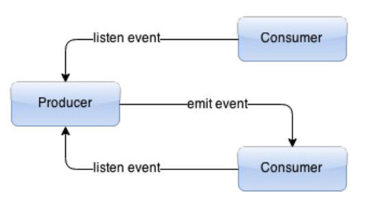

#Node.js 하이 퍼포먼스


## 1장. 소개 및 컴포지션
Node.js는 libuv를 사용한 블로킹하지 않는 I/O 모델로 되어 있다. 이 I/O 모델의 API를 사용해 파일시스템에 접근하고 네트워크 서비스에 연결하거나 자식 프로세스를 실행 할 수 있다.

이 API에는 버퍼와 스트림이라는 중요한 요소가 있다. 자바스크립트 문자열은 유니코드에 친화적이므로 이진 데이터 처리에 도움을 주기 위해 버퍼를 사용한다. 스트림은 데이터 전달을 위한 간단한 이벤트 인터페이스로 사용된다. 따라서 버퍼와 스트림은 모든 API에서 파일 내용을 읽어오거나 네트워크 패킷을 받는데 사용된다.

스트림은 네크워크 모듈과 유사한 모듈이다. 이 모듈을 로드하면, 읽기가능(readable), 쓰기가능(writable), 듀플렉스(duplex-읽기쓰기가 모두 가능한 스트림으로 소스와 목적지 양쪽을 처리[소켓]), 트랜스폼(transform-듀플렉스의 확장으로 소스와 목적지 사이에 데이터 변형이수행된다.[데이터 압축]) 스트림을 생성할 수 있는 기본 클래스에 접근할 수 있다. 이 스트림을 사용하면 간소화되고 통합된 형태의 데이터 처리를 수행할 수 있다.

버퍼 모듈은 이진 데이터 형식을 JSON 같은 다른 형식으로 전환 할 때 유용하다. 다중 읽기/쓰기 메소드는 부호 및 엔디안에 상관없이 정수형과 실수형을 8비트에서 8바이트까지 전환할 수 있다.

### 성능분석
JSCS같은 스타일 가이드를 활용하여 JSHint같은 Linter를 사용할 수 있다.
- 최적화되기 쉽도록 가능한 한 함수를 작게 작성한다.
- 단일 형태의 파라미터나 변수를 사용한다.
- 정수 인덱스 엘리먼트가 빠르기 때문에 데이터를 조작하는 데 배열을 사용한다.
- 작은 객체를 유지하고 긴 프로토타입 체인은 피한다.
- 큰 객체에서 작업이 느려질 수 있는 객체 복제는 피한다.

### 애플리케이션 컴포지션
컴포지션은 애플리케이션의 유지보수, 개발, 이해가 용이하게 애플리케이션을 작은 단위로 나누는 방식을 말한다. 물론 이를 통해 테스트나 성능을 더 용이하게 개선할 수 있다.

코드는 항상 작은 단위로 나눠야한다. Node.js는 이에 대한 쉬운 방법을 제공한다. 5KB보다 큰 파일은 나누기를 고려해야 한다. 또한 사용자 정의 객체는 분할된 파일 하나로 생성하는 것도 좋은 규칙이 된다. 이에 맞춰 파일명을 정해준다.
```javascript
// MyObject.js
module.exports = MyObject;

function MyObject() {
  // ...
}

MyObject.prototype.myMethod = function () { ... };
```
```
Tip
애플리케이션이 커지면, 나중에 우리가 수정하기 위해 파일을 열었을때 새로운 개발자나 다름없는 상태가 된다는 것을 잊지말자. 애플리케이션의 모든 코드를 암기하는 것은 절대로 불가능하므로 최대한 빨리 파일을 보고 내부 동작을 이해할 수 있어야 한다.
```

플랫폼이 비동기적으로 설계됐기 때문에 이를 거스르려고 해서는 안된다. `async`를 사용하면 개발자들은 간단하고 실용성 있게 성능을 높일 수 있을 뿐 아니라 사용법도 쉽게 익힐 수 있다.
```javascript
async.each(users, function(user,next){
	// 각 사용자 객체에 대한 일을 수행
    return next();
}, function(err){
	// 완료
});
```
이 모듈에는 map, reduce, filter, each 같은 배열 객체에서 비동기적으로 반복해 내용을 찾는 것을 수행하는 여러가지 메소드들이 있다. 이 모듈은 사용자의 동작이 연속적인 작업을 수행해 애플리케이션의 복잡도가 증가하는 경우 매우 유용하다.

콜백의 첫 번째 인수가 null이라면 에러 이벤트를 위해 사용한다. 이를 통해 함수들이 async모듈과 같이 사용될 수 이다. 또한 다른 개발자들도 디버깅 시에 이런 스타일을 기대하므로, 첫 번째 인수는 항상 오류 객체를 위해 사용한다.
```javascript
function mySuperFunction(arg1, ..., argN, next) {
	// 처리할 작업의 위치
    return next(null, my_resut); // 에러 처리를 위한 첫 번째 인수
}
```

반복적인 작업 중 일부는 `lodash`나 `underscore` 같은 라이브러리를 사용하는 것만으로 해결된다. 이 라이브러리들은 매우 중요한 코드며, 고민하지 않아도 될 정도로 좋은 최적화 방법들이다.

#### 함수 규칙사용
공통적인 구조를 강제함으로써 몇몇 오류들을 피할 수 있게 해준다. 이러한 규칙은 JSCS(http://jscs.info/) 를 사용해 적용할 수 있다.
1. 콜백으로 사용되는 클로저 함수인 경우 반드시 함수명을 명시해야 한다.
```javascript
socket.on('data', function onSocketData(data){
	// ...
});
```
2. 조건 분기를 중첩해 사용하지 말고, 반환은 가능한 빠르게 하자.
3. 함수를 작고 단순하게 작성하자

#### 작성한 모듈 테스트
vows, chai, mocha같은 테스트 도구들이 있다. 처음에는 다른 모듈의 테스트 코드를 보거나 모듈의 도움말 문서부터 읽어보자. (세마포어 사이트내에 있는 이고르(Igor)의 포스팅(https://semaphoreci.com/community/tutorials/getting-started-with-node-js-and-mocha) 도 도움이 된다.)

## 2장. 개발패턴
`패턴`? 개념적인 것으로, 일반적인 프로그래밍 문제들에 대한 재사용 가능한 해결책을 말한다.

#### 패턴유형
모듈을 사용하고 다른 인터페이스를 생성한다면, 구조 패턴의 하나인 `어댑터패턴`이 사용될 수 있다. 다운로드한 모듈을 몇 가지 기능의 메소드를 추가해 확장할 필요가 있다면, 또 다른 구조패턴인 `데코레이터 패턴`이 사용될 수 있다.
다운로드한 모듈이 다소 많은 정보로 초기화돼야 한다면, 생성 패턴의 하나인 `팩토리 패턴`이 사용될 수 있다. 애플리케이션이 발전돼 초기 설정에서 많은 유연성이 요구된다면, 또 다른 생성패턴인 `빌더패턴`이 사용된다.
애플리케이션이 관계형 데이터에 접근한다면, `액티브 레코드 패턴`이 사용돼야 한다. 그리고 소프트웨어 프레임워크같은 것들을 사용한다면 `MVC 패턴`이 사용된다.

#### 아키텍처적 패턴
1. 프론트 컨트롤러 패턴 : 들어오는 모든 요청을 유일한 컨트롤러에서 처리하는 형태이다.

2. MVC패턴 :

3. 액티브 레코드 패턴 : 단순 데이터 객체를 제공함으로써 관계형 데이터에 접근할 때 사용되는 추상적인 레이어다. 객체-관계형 매핑(ORM)라이브러이에 사용된다.

4. 서비스 로케이터 패턴 : 중앙 레지스트리를 사용해 서비스의 접근을 추상화하는 개념이다. 장점은 작업 부하에 대한 적응을 가능하게 한다는 것이고 단점은 잠재적으로 아무도 원하지 않는 단일 문제점이 될수 있다.

5. 이벤트 주도 패턴 : 이벤트의 생산 및 소비를 촉진시키는 패턴이다. 이 구성은 프로그래밍 로직이 이벤트에 반응하도록 만든다. 이벤트는 상태의 변경을 의미하는데, 예를 들면 네티워크 연결이 생성되고, 데이터를 전달받고, 파일 처리가 종료되는 것들을 말한다. 소비자라고 불리는 이벤트 감지 객체는 생산자인 해당 이벤트 이미터에 리스너(수신 대기자)를 등록한다. 생산자 객체가 이벤트에 대한 상태 변환를 감지하면, 소비자 객체에 이벤트가 발생했음을 알린다.


#### 생성 패턴
1. 팩토리 메소드 패턴 : 특정 클래스로부터 애플리케이션을 추상화하고 새로운 객체를 생성하기 위해 사용된다. 이 패턴에서 메소드가 호출되면, 새로 생성되거나 재사용되는 객체가 반환된다. 데이터베이스 연결이나 데이터 정보 서비스 접근은 이 패턴을 사용하기에 아주 좋다.

2. 지연 초기화 패턴 : 복잡한 표현식을 계산하거나 객체를 생성하는 것을 지연시킬 때 사용되며, 지연로딩이라고도 한다.
3. 단일체 패턴 : 작업을 효과적으로 하기 위해 애플리케이션에서 단일 객체 인스턴스가 요구될 때 사용된다. 이 패턴은 일반적으로 클래스 자체에서 사용되며, 클래스에서는 개발자가 새로운 인스턴스를 만들기 위한 메소드를 만들고, 만약 이미 만들어진 인스턴스가 있다면 그것을 반환하도록 한다.

4. 빌더 패턴 : 다른 클래스의 인스턴스를 만드는 클래스다.

5. 객체 풀 패턴 : 풀이라 불리는 객체의 집합체가 다른 컴포넌트에 사용되기 위해 준비된 상태로 유지된다. 이 패턴은 커넥션 풀과 초기화 시간이 매우 중용한 명령어와 관계가 있다.


#### 구조 패턴
1. 적응자 패턴 : 서로 호환성이 없는 두 컴포넌트를 공통의 인터페이스로 연결하고자 할 때 사용된다.유사한 패턴들 사이에서 이 패턴을 구분할 수 있는 규칙은 두 컴포넌트를 연결하고 있는 적응자는 어떠한 로직도 가지고 있지 않는다는 점과 새로운 공통 인터페이스로의 연결을 위한 두개의 인터페이스만 허용한다는 점이다.

2. 복합체 패턴 : 객체의 그룹이나 단일 객체가 동일한 방식으로 다뤄지고 접근돼야 할때 사용된다. 예로 JQuery가 있다.

3. 장식자 패턴 : 동일 클래스에 있는 다른 객체의 행동에는 영향을 미치지 않으면서 특정 객체에 기능을 더하기 위해 사용된다. 이 패턴은 사실 자바스크립트의 기반 원칙인 프로토타입적인 상속의 기반이 된다.

4. 퍼사드 패턴 : 복잡한 라이브러리를 사용하고 이해하기가 더 쉬운 인터페이스로 감쌀 때(래핑할때)사용된다.

5. 프록시패턴 : 일반적으로 복잡한 작업을 단순화하기 위해 사용.


#### 행동 패턴
1. 중재자 패턴 : 중재자라고 하는 추상 계층을 만들어 다수 클래스 간의 통신을 처리한다.

2. 감시자 패턴 : 자식 객체의 목록을 유지하고 감시자를 호출해 각 자식 객체에서 제공하는 메소드를 호출하는 것으로 변화를 알려준다.


## 3장. 가비지컬렉션

#### 서드파티 관리
애플리케이션을 더 작은 컴포넌트로 나누는 것을 고려한다면, 일부 객체나 조작을 위한 부분을 외부 서비스로 옮기는 것도 좋은 방법이다. 이런 서비스들은 특정 작업이나 객체 형태에 따라 최적화되기도 한다.

- 키/밸류를 위한 memcached와 리스트, 집합, 해시테이블을 위한 Redis
- 자바스크립트로 데이터 관련 작업을 수행하기 위한 MongoDB, 그리고 문서 내부의 문서와 같은 계층 엘리먼트나 데이터 타임아웃 같은 기능을 위한 ElasticSearch
- 다소 복잡한 맵/리듀스 코드가 필요한 경우에는 HBase, 그리고 이러한 코드의 경량화버전인 Hypertable
- 그래프 데이터베이스가 필요하면 OrientDB, 큰 바이너리 데이터를 저장하기 위한 Riak

## 6장. 테스트, 벤치마킹, 분석

#### 도커툴
도커는 무료며 컨테이너를 사용할 수 있도록 해주는 툴이다.
Vagrant와는 큰 차이점을 가지며, 환경을 만들기 위해 가상 환경이 필요치 않다. 도커는 OpenVZ와 비슷하지만 약간의 차이점을 가진다. 환경(컨테이너)을 만들 수도 있고, 다른 사람에게 공유할 수도 있다. 버전과 의존성을 지원하고 있으며, 자주 사용되는 환경은 이미 온라인에서 제공되고 있으므로 다운로드해서 사용할 수 있다.

#### 테스트 툴
```
npm install -g mocha
```

```javascript
// module.js
// a와 b를 더하기
exports.add = function(a, b){
	return a+b;
}
// test.js
var assert = require('assert');
var m = require('./module');

describe('module.add()', function(){
	it('should add two numbers', function(){
    	assert.equal(m.add(2,3), 5);
    });
});

실행 : mocha
```

#### 코드 커버리지
코드 커버리지는 당신의 코드 중 테스트 스위트에서 얼마나 다뤄졌는지 나타내는 측정 지표다. 적용 가능한 가장 적합한 툴로는 istanbul이 있다.

```
npm install -g istanbul mocha-istanbul
```
istanbul Node.js 모듈은 명령어를 사용해야 하므로 전역 특성을 가진다. 이제 예제코드에 인스트루먼트를 해보자. 우선 인스트루먼트된 복사본을 만들어본다.
```
istanbul instrument module.js > instrumented.js
```
인스트루먼트된 버전을 사용하기 위해 테스트 스위트를 변경해야한다.
```javascript
var assert = require('assert');
var m = require('./instrumented');

describe('module.add()', function(){
	it('should add two numbers', function(){
    	assert.equal(m.add(2,3), 5);
    });
});
```

```
// 실행
mocha -reporter mocha-istanbul test.js
```

mocha가 제공하는 기능
- 메모리 누수탐지(테스트 이전/이후의 전역 변수를 관찰한다.)
- 비정상적 예외 상황 탐지(원인이 되는 테스트를 살핀다)
- 끊김 없는 비동기 지원
- Node.js 디버거 지원
- 브라우저 지원
