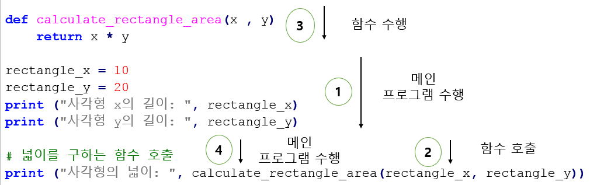
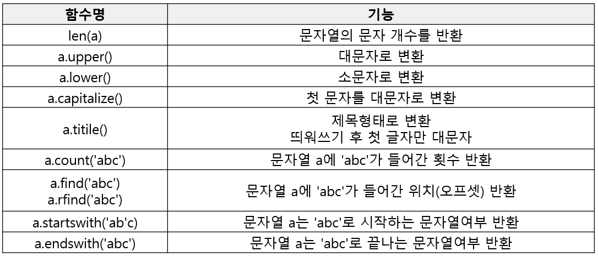
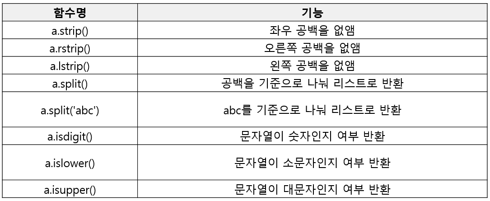
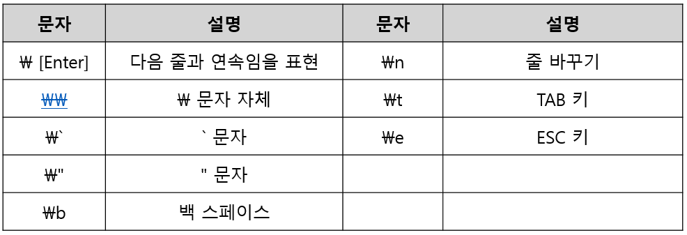

## 함수
- 어떤 일을 수행하는 코드의 덩어리
```python
# 사각형의 넓이를 구하는 함수
def calculate_rectangle_area(x, y):
    return x * y

x = 20
y = 10
print("사각형의 넓이 : ", calculate_rectangle_area(x, y))    
```
수행순서 


### 함수호출 방식
1. 값에 의한 호출(Call by Value)
    - 함수에 인자를 넘길때 값만 넘김. 함수 내에 인자 값 변경 시, 호출자에게 영향을 주지 않음
2. 참조의 의한 호출(Call by Reference)
    - 함수에 인자를 넘길 때 메모리 주소를 넘김. 함수 내에 인자 값 변경시, 호출자의 값도 변경됨

파이썬은 **객체의 주소가 함수**로 전달되는 방식    
- 전달된 객체를 참조하여 변경 시 호출자에게 영향을 주나, 새로운 객체를 만들경우 호출자에게 영향을 주지 않음
```python
def spam(eggs):
    eggs.append(1) # 기존 객체의 주소값에 1추가
    eggs = [2,3] # 새로운 객체 생성

ham = [0]
spam(ham)
print(ham) # [0,1]    
```

### 변수의 범위
- 변수가 사용되는 범위

1. 지역변수 : 함수내에서만 사용
2. 전역변수 : 프로그램 전체에서 사용
    - 전역변수는 함수에도 사용가능하나 함수내에 전역변수와 같은 이름의 변수를 선언하면 새로운 지역변수가 생김.
    - 함수내에서 전역변수 사용하고 싶으면 global 키워드 사용
```python
def f():
    s = "I love London!!"
    print(s)
def p():
    global s
    s = "I love London!!"
    print(s)    

s = "I love Paris!!"
f() # I love London!!
print(s)  # I love Paris!!
p() # I love London!!
print(s) # I love London!!
```  

## Swap
- 함수를 통해 변수 간의 값을 교환하는 함수
```python
def swap_value (x, y):
	temp = x
	x = y
	y = temp


def swap_offset(offset_x, offset_y):
	temp = a[offset_x]
	a[offset_x] = a[offset_y]
	a[offset_y] = temp

def swap_reference (list_ex, offset_x, offset_y):
	temp = list_ex[offset_x]
	list_ex[offset_x] = list_ex[offset_y]
	list_ex[offset_y] = temp

a = [1,2,3,4,5]
swap_value(a[1], a[2])
print(a) # [1,2,3,4,5]
a = [1,2,3,4,5]
swap_offset(1,2)
print(a) # [1,3,2,4,5] a리스트의 전역변수 값을 직접 변경
a = [1,2,3,4,5]
swap_reference(a,1,2)
print(a) # [1,3,2,4,5] a리스트 객체의 주소값을 받아 값을 변경
```

### 재귀함수
- 자기 자신을 호출하는 함수
- 점화식과 같은 재귀적 수학 모형을 표현할 때 사용
- 재귀 종료조건 존재, 종료 조건까지 함수호출 반복
```python
def factorial(n):
    if n == 1 :
        return 1
    else :
        return n + factorial(n-1)

print(factorial(int(5)))                     
```

### 코딩 컨벤션
- 사람이 이해할수 있는 코드를 짜기 위한 규칙

파이썬 코딩 컨벤션 예시
- 들여쓰기는 Tab or 4 Space 논쟁
- 일반적으로 4 Space를 권장함

PEP8 - 코딩의 기준을 제시해주고 있음
- 들여쓰기 공백4칸을 권장
- 한 줄을 최대 79자까지
- 불필요한 공백은 피함
- 연산자는 1칸 이상 안 띄움
- 주석은 항상 갱신, 불필요한 주석은 삭제
- 소문자 l, 대문자 O, 대문자 I 금지
- 함수명은 소문자로 구성, 필요하면 밑줄로 나눔
- "flake8"모듈로 체크 : flake8 <파일명>

함수 작성 가이드라인
- 함수는 가능하면 짧게 작성할 것
- 함수 이름에 함수의 역할, 의도가 명확히 들어낼 것
- 하나의 함수에는 유사한 역할을 하는 코드만 포함
- 인자로 받은 값 자체를 바꾸진 말것(임시변수 선언)


## 문자열
- 시퀀스 자료형으로 문자형 data를 메모리에 저장
- 영문자 한 글자는 1byte의 메모리 공간을 사용
```python
import sys # sys 모듈을 호출 
print(sys.getsizeof("a"), sys.getsizeof("ab"), sys.getsizeof("abc"))

# "a", "ab", "abc"의 각 메모리 사이즈 출력
```
### 인덱싱(Indexing)
- 문자열의 각 문자는 개별 주소(offset)를 가짐
- 이 주소를 사용해 할당된 값을 가져오는 것이 인덱싱
- List와 같은 형태로 데이터를 처리함
```python
a = "abcde"
print(a[0], a[4]) # a e
```
### 문자열 연산 및 포함여부 검사
```python
a = "abcde"
b = "hahaha"
print(a + " " + b ) # 덧셈으로 a와 b 연결하기
print(a * 2 +" "+ b * 2 ) # 곱하기로 반복 연산 기능
if 'c' in a :  # 'c'가 포함되어 있는지 확인 
    print(a)
else : 
    print(b)
```

### 문자열 함수



### 문자열 표현
- 두둘 이상은 어떻게 저장할까 ?
    1.  \n 특수문자 사용
    2. 큰따옴표 또는 작은 따옴표 세번 연속사용 
    ```python
    a = """ It' Ok
            I'm Happy.
            See you """
    ```
    
### 특수문자


### 예제- 텍스트를 읽어서 Yesterday가 몇개 나오는지 구하여라
```python
f = open("yesterday.txt", "r")
yesterday_lyric = ""
while 1:
	line = f.readline()
	# print(line)
	if not line:
		break
	yesterday_lyric = yesterday_lyric + line.strip() + "\n"
	# print (yesterday_lyric)
f.close()
n_of_yesterday = yesterday_lyric.upper().count("yesterday")
print ("Number of a Word 'Yesterday'" , n_of_yesterday)
```
