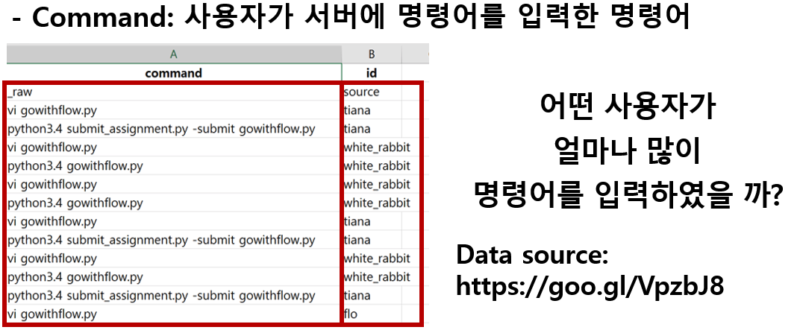

# 자료구조

## 데이터 구조(Data Structure)
- 메모리상에 데이터를 효율적으로 관리하는 방법
- 검색, 저장 등의 작업에서 효율을 고려하여 메모리 사용량과 실행시간 등을 최소화 함
- 파이썬에서는 리스트, 튜플, 집합(Set), 사전(dictionary)등의 기본 데이터 구조를 제공함

## 스택(Stack)
- 나중에 넣은 데이터를 먼저 반환하도록 설계된 메모리 구조로 Last In First Out(LIFO)로 구현됨
- Data 입력을 Push, 출력을 Pop이라고 함
- 리스트를 사용하여 스택 구조를 활용
- push를 append(), pop을 pop()를 사용
```python
a = [1,2,3,4,5]
print(a) # [1,2,3,4,5]
a.append(10)
print(a) # [1, 2, 3, 4, 5, 10]
a.append(30)
print(a) # [1, 2, 3, 4, 5, 10, 30]
a.pop()
print(a) # [1, 2, 3, 4, 5, 10]
a.pop()
print(a) # [1,2,3,4,5]
```
- 스택구조를 활용, 입력된 글자를 역순으로 출력하는 예제
```python
word = input("Input a word: ")
world_list = list(word)

for i in range(len(world_list)):
    print(world_list.pop())
```

## 큐(Queue)
- 먼저 넣은 데이터를 먼저 반환하도록 설계된 메모리 구조로 First In First Out으로 구현됨.
- Stack 반대되는 개념
- 리스트를 사용하여 스택 구조를 활용
- put을 append(), get을 pop(0)를 사용
```python
a = [1,2,3,4,5]
print(a) # [1,2,3,4,5]
a.append(10)
print(a) # [1, 2, 3, 4, 5, 10]
a.append(30)
print(a) # [1, 2, 3, 4, 5, 10, 30]
a.pop(0)
print(a) # [2, 3, 4, 5, 10, 30]
a.pop(0)
print(a) # [3, 4, 5, 10, 30]
```

## 튜플(tuple)
- 값의 변경이 불가능한 리스트
- 선언시 "[]"가 아닌 "()"를 사용
- 리스트의 연산, 인덱싱, 슬라이싱 등을 동일하게 사용
- 프로그램을 작동하는 동안 변경되지 않는 데이터를 저장할때 많이 사용 : 학번, 이름, 우편번호 등등
```python
t = (1,2,3)
print(t)
t[1] = 5 # Error 발생

a = (1) # 일반 정수로 인식
a = (1,) # 값이 하나인 Tuple로 인식 
```

## Set
- 값을 순서없이 저장, 중복 불허 하는 자료형
- set 객체 선언을 이용하여 객체 생성
```python
s = set([1,2,3,1,2,3])
print(s) #
s.add(1) # 한 원소 1만 추가
print(s)
s.remove(1) # 1 삭제
print(s)
s.update([1,4,5,6,7]) # [1,4,5,6,7] 추가
print(s)
s.discard(3) # 3삭제
print(s)
s.clear()  # 모든원소 삭제
print(s)
```
- 수학에서 활용하는 다양한 집합연산 가능
```python

s1 = set([1,2,3,4,5])
s2 = set([3,4,5,6,7])
s3 = s1.union(s2)  # s1과 s2의 합집합
print(s3)
print(s1 | s2)
s3 = s1.intersection(s2)  # s1과 s2의 교집합
print(s3)
print(s1 & s2)
s3 = s1.difference(s2)  # s1과 s2의 차집합
print(s3)
print(s1 - s2)
```


## 사전(dictionary)
- 데이터를 저장 할 때는 구분 지을 수 있는 값을 함께 저장
- 구분을 위한 데이터 고유값을 Identifier 또는 Key라고 함
- Key 값을 활용하여, 데이터 값(Value)를 관리함
- 다른 언어에서는 Hash Table이라는 용어를 사용
```python
country_code = {} # Dict 생성
country_code = {"america":1, "korea":82,"china":86,"japan":81}
print(country_code)
print(country_code.items()) # Dict 데이터 출력
country_code["german"] = 49 # Dict 추가
print(country_code.keys()) # Dict key만 출력
print(country_code.values()) # Dict value만 출력
```

- 예제


```python
import csv

def getKey(item):		# 정렬을 위한 함수
    return item[1]		# 신경 쓸 필요 없음

command_data = []		# 파일 읽어오기
with open("command_data.csv", "r", encoding="utf8") as csvfile:
     spamreader = csv.reader(csvfile, delimiter=',', quotechar='"')
     for row in spamreader:
        command_data.append(row)

print(command_data[3])

command_counter = {} 			# dict 생성, 아이디를 key값, 입력줄수를 value값
for data in command_data:		# list 데이터를 dict로 변경
    if data[1] in command_counter.keys(): 	# 아이디가 이미 Key값으로 변경되었을 때
        command_counter[data[1]] += 1		# 기존 출현한 아이디
    else:
        command_counter[data[1]] = 1		# 처음 나온 아이디

dictlist = []				# dict를 list로 변경
for key, value in command_counter.items():
    temp = [key,value]
    dictlist.append(temp)

sorted_dict= sorted(dictlist, key=getKey, reverse=True) # list를 입력 줄 수로  정렬
print (sorted_dict[:100])			# List의 상위 10객값만 출력

```
