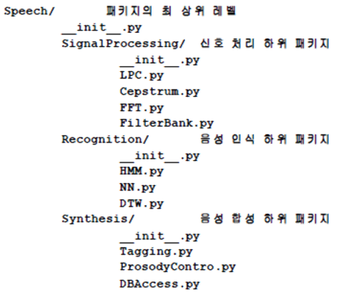

# Module & Packages
- 파이썬은 대부분의 라이브러기가 이미 다른 사용자에 의해서 구현되어 있음.

## 모듈
- 어떤 대상의 부분 혹은 조각
- 프로그램에서는 작은 프로그램 조각들, 모듈들을 모아서 하나의 큰 프로그램을 개발함.
- 프로그램을 모듈화 시키면 다른 프로그램이 사용하기 쉬움
- Built-in 모듈인 Random을 사용하면 난수를 쉽게 생성할수 있음. 
```python
#난수
import random
print (random.randint (0,100)) # 0~100사이의 정수 난수를 생성
print (random.random())  # 일반적인 난수 생성
#시간
import time
print(time.localtime()) # 현재 시간 출력

#웹
import urllib.request
response = urllib.request.urlopen("http://cs50.gachon.ac.kr")
print(response.read())
```

### 모듈 만들기
- 파이썬의 Module == py파일을 의미
- 같은 폴더에 Module에 해당하는 .py파일과 사용하는 .py을 저장한 후 import문을 사용해서 호출
```python
#fah_converter.py
def covert_c_to_f(celsius_value):
    return celsius_value * 9.0 / 5 + 32

# module_ex.py
import fah_converter

print ("Enter a celsius value: "),
celsius = float(input())
fahrenheit = fah_converter.covert_c_to_f(celsius) # my_module의 c_to_f 호출
print ("That's ", fahrenheit, " degrees Fahrenheit")    
```
### Namespace
- 모듈을 호출할 때 범위 정하는 방법
- 모듈 안에는 함수와 클래스 등이 존재 가능
- 필요한 내용만 골라서 호출 할 수 있음
- from 과 import 키워드를 사용함
```python
# 별칭 사용
import fah_converter as fah
print(fah.covert_c_to_f(41.6))
# 특정 함수또는 클래스만 호출
from fah_converter import covert_c_to_f
print(covert_c_to_f(41.6))
# 전체 호출
from fah_converter import *
print(covert_c_to_f(41.6))
print(test_value)
```

## 패키지
- 모듈을 모아놓은 단위, 하나의 프로그램
- 다양한 모듈들의 합, 폴더로 연결됨
- __init__, __main__ 등 키워드 파일명이 사용됨
- 다양한 오픈 소스들이 모두 패키지로 관리됨
- 예제 참조 : game폴더



## 가상환경
1. virtualenv
    - 가장 대표적인 가상환경 관리도구
    - 레퍼런스+패키지 개수
2. conda
    - 상용 가상환경도구
    - 설치의 용이성     

