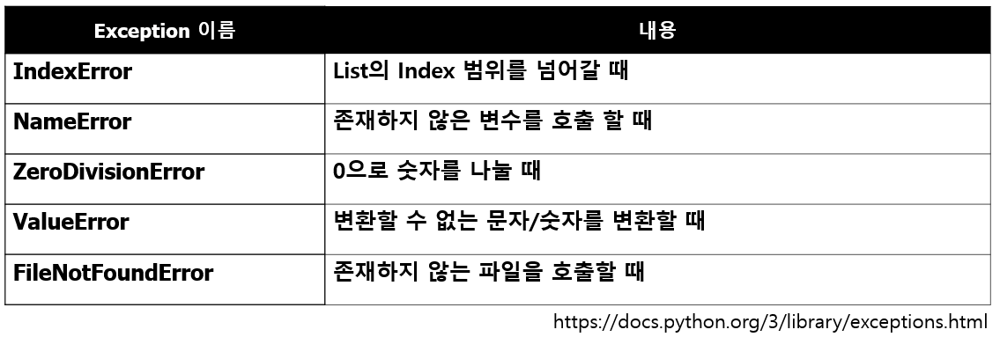

# Exception Handling

## Exception
### 예상 가능한 예외
- 발생여부를 사전에 인지할 수 있는 예외
- 사용자의 잘못된 입력, 파일 호출시 파일 없음
- 개발자가 반드시 명시적으로 정의 해야함
### 예상이 불가능한 예외
- 인터프리터 과정에서 발생하는 예외, 개발자 실수
- 리스트의 범위를 넘어가는 값 호출, 정수 0으로 나눔
- 수행 불가시 인터프리터가 자동 호출

## 예외 처리
- 예외가 발생할 경우 후속 조치등 대처 필요
1) 없는 파일 호출 -> 파일 없음을 알림
2) 게임 이상 종료 -> 게임 정보 저장


### 예외 처리 방법 
- 0으로 숫자를 나눌 때 예외처리 하기 
```python
for i in range(10):
    try:
        print(i, 10 // i)
    except ZeroDivisionError as e:
        print(e)
        print("Not divided by 0")
```
- try ~ except ~ else 
```python
for i in range(10):
    try:
        result = 10 / i
    except ZeroDivisionError:
        print("Not divided by 0")
    else: # 예외가 발생하지 않을 때 동작하는 코드
        print(10 / i)
```
- try ~ except ~ finally
```python
for i in range(0, 10):
    try:
        result = 10 // i
        print(i, "------", result)
    except ZeroDivisionError:
        print("Not divided by 0")
    finally: # 예외 발생 여부와 상관없이 실행됨
        print("종료되었습니다.")

```

- raise 구문 : 필요에 따라 강제로 Exception 발생
```python
while True:
    value = input("변환할 정수값을 입력해주세요")
    for digit in value:
        if digit not in "0123456789":
            raise ValueError("숫자값을 입력하지 않으셨습니다")
    print("정수값으로 변환된 숫자 -", int(value))

```

### Built-in Exception
